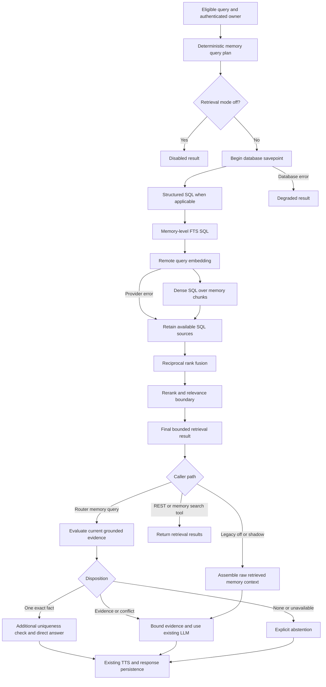
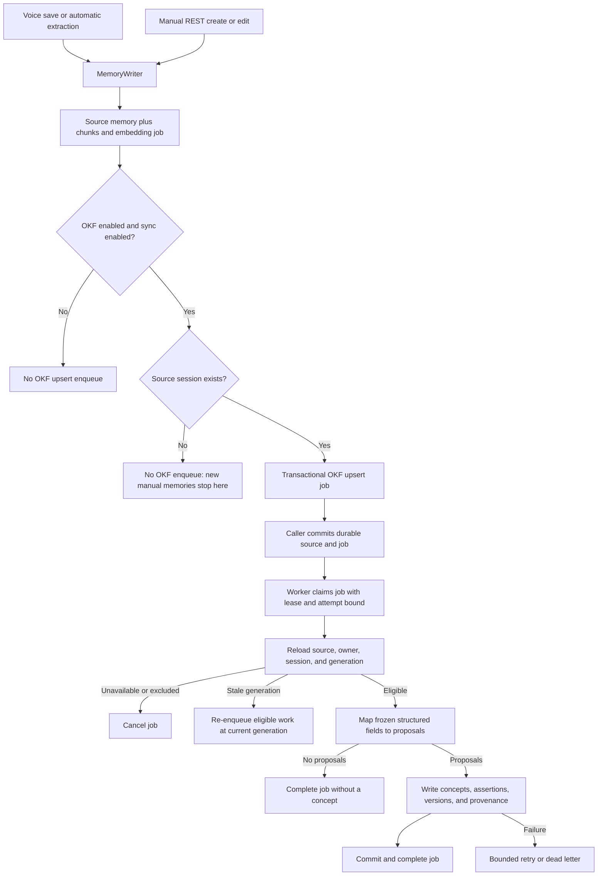
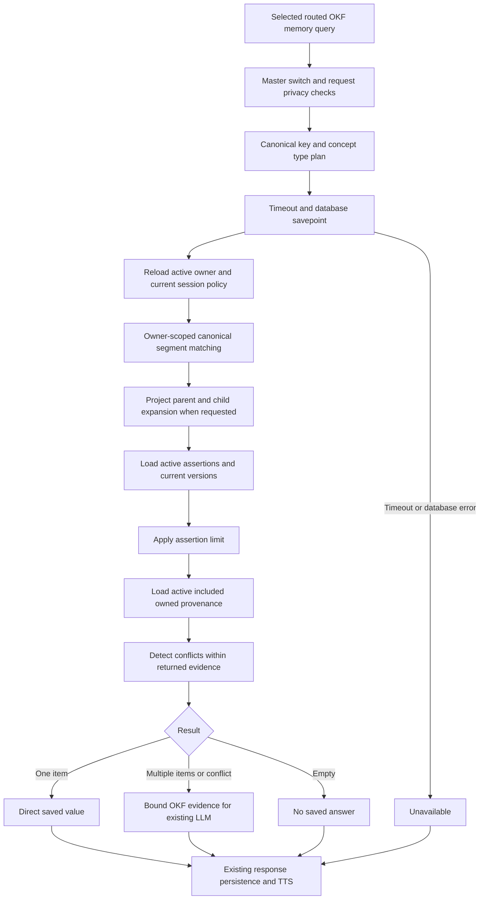
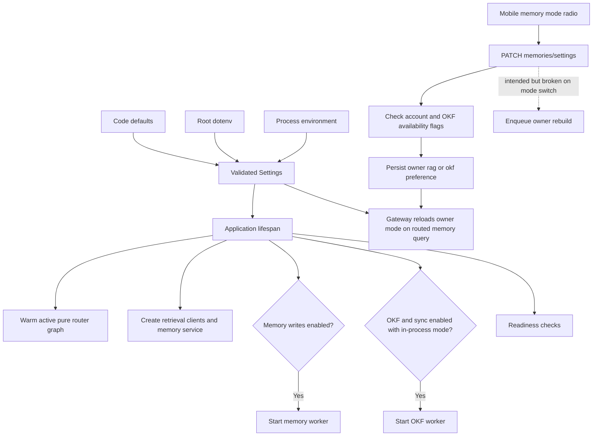
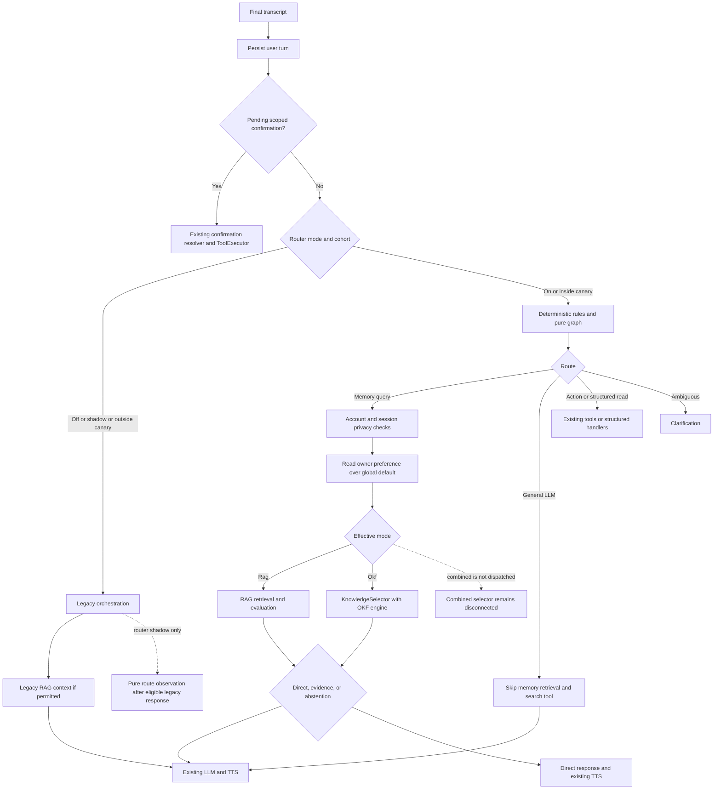
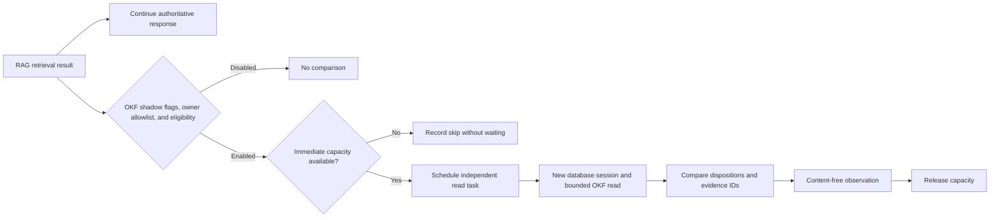

# Hybrid RAG, Google OKF, configuration, and router review

**Review date:** 2026-10-05, 13:27 PDT (America/Los_Angeles).  
**Reviewed state:** Current working tree, including existing uncommitted changes.  
**Change scope:** This review document only. No application code, configuration, dependencies, or database data were changed.  
**Overall assessment:** The core services exist and focused tests   pass, but the five requested areas are not all implemented correctly end to end. There are confirmed privacy, routing, synchronization, and conflict-handling gaps. The internal OKF engine is not an implementation of Google's Open Knowledge Format.

## Review todo and coverage

- [x] Read repository instructions and project plans.
- [x] Inventory the codebase and trace Hybrid RAG storage, writes, retrieval, evaluation, and response generation.
- [x] Trace internal OKF schema, mapping, jobs, retrieval, provenance, and lifecycle controls; compare its scope with Google's specification.
- [x] Inspect configuration defaults, local loaded settings, startup, readiness, deployment, and mobile settings.
- [x] Trace integration for router off, shadow, canary, and on; check owner-selected modes and combined mode.
- [x] Reproduce suspected problems with focused tests and in-memory probes.
- [x] Provide current workflow diagrams and distinguish missing connections from implemented paths.
- [x] Check report references and verify the requested five points are covered.

| Requested point | Current assessment | Covered below |
|---|---|---|
| 1. Hybrid RAG implementation | Implemented, with source exclusion and retrieval/evaluation inconsistencies | Sections 1, 4, 6 |
| 2. Google OKF implementation | Internal structured engine implemented; Google format interoperability absent | Sections 2, 6 |
| 3. Configuration settings | Local configuration validates; precedence, rollout, readiness, and container wiring have gaps | Sections 3, 6 |
| 4. Integration with router mode | RAG and OKF work through selected routed paths; combined and legacy OKF paths are disconnected | Sections 4, 6 |
| 5. Proper workflow diagrams | Six diagrams of actual implemented paths, with gaps called out | Sections 1–5 |

**Scope and limits:** Repository-wide inventory and a syntax scan of all 141 Python files under `backend/app`; detailed tracing of the relevant backend, migrations, frontend memory controls, voice protocol, scripts, tests, and deployment files. This is not a line-by-line audit of unrelated authentication, audio DSP, or task scheduling internals. Generated dependencies, models, binaries, and logs were not treated as implementation source. Two pre-existing generated directories, `scratch/pytest_tmp` and `backend/scratch/pytest_cache`, denied enumeration; relevant source remained accessible.

## 1. Hybrid RAG implementation

### Current components and connections

| Component | Current implementation |
|---|---|
| Durable source | `MemoryItem` stores owner, content, type, subject/predicate/object, status, timestamps, source provenance, dedupe key, and supersession |
| Search storage | `MemoryChunk` stores chunks and `VECTOR(1024)` embeddings; memory and chunk FTS indexes exist; dense HNSW index exists |
| Write seam | [MemoryWriter](backend/app/memory/writer.py) writes source rows, chunks, embedding jobs, and eligible OKF jobs in the caller's transaction |
| Extraction | [extraction.py](backend/app/memory/extraction.py) is deterministic; normal preferences/durable statements and explicit remember requests are supported, with limited structured project parsing |
| Worker | [jobs.py](backend/app/memory/jobs.py) handles extraction, embedding, re-embedding, session purge, and graph indexing; jobs use leases, retries, and terminal states |
| Query plan | [types.py](backend/app/memory/types.py) infers broad intent, category, today/yesterday windows, and lexical terms; normal planning does not fill subject/predicate slots |
| Retrieval | [retrieval.py](backend/app/memory/retrieval.py) runs structured retrieval when applicable, FTS, embedding/dense search, RRF, reranking, and a relevance boundary |
| Evaluation | [evaluation.py](backend/app/memory/evaluation.py) checks ready status, ownership, active/current evidence, anchors, conflicts, and eligibility for a direct answer |
| Context | [context.py](backend/app/memory/context.py) has ordinary legacy context and richer routed evidence context |
| Response integration | [gateway.py](backend/app/websocket/gateway.py) either speaks a direct result or passes evidence into the existing LLM/TTS path |
| User controls | [memories.py](backend/app/api/memories.py), [sessions.py](backend/app/api/sessions.py), and [MemoryScreen.tsx](frontend/src/screens/MemoryScreen.tsx) expose create/edit/delete, account enablement, search, and session exclusion |

The active FTS path queries `memory_items.search_tsv`, not chunk FTS. Dense retrieval aggregates the minimum chunk distance per memory. SQL stages are sequential on one `AsyncSession`; there is no concurrent three-source query execution. RRF combines rank positions, not raw cosine/FTS scores. Reranker results replace the fused score with a separate relevance score.

Embedding and reranker clients validate model names, dimensions, response bounds, and result indexes. They reuse the configured STT authentication header/key. Embedding failure retains lexical/structured candidates. Reranker failure removes dense-only candidates. Database errors are contained by a savepoint and converted into a degraded result. These are improvements over the older [Phase 6 audit](docs/phase6_hybrid_rag_current_implementation_audit.md); that older report is not the current implementation baseline.

### Hybrid RAG read workflow



**Diagram caveats:** Dense SQL omits source-session exclusion and query category/time filters (F01/F11). Legacy context does not run the routed evaluation boundary (F12). A degraded result retains useful candidates, but routed evaluation rejects every degraded result (F12). The memory-search tool has a separate missing current-session exclusion check (F16).

### Writes and lifecycle

The gateway persists the final user turn, resolves pending confirmations before new routing, and may enqueue automatic extraction when writes and privacy policy permit it. Explicit tool saves go through the existing ToolExecutor confirmation/idempotency boundary. Accepted writes converge on `MemoryWriter`; automatic extraction is a separate worker path, not an LLM-driven OKF extraction step. Preference supersession exists; arbitrary facts are not automatically reconciled into one current value.

Manual REST creation remains enabled for an account even when the operator's `MEMORY_WRITE_ENABLED` is false; the code explicitly documents that product decision. Such writes still enqueue embedding jobs, but the embedded worker starts only when the operator write flag is true. Manual memories can therefore remain lexical-only until a worker is enabled.

GraphRAG is a separate subsystem in [backend/app/graph](backend/app/graph). Graph schema, indexing, bounded traversal, and evidence services exist, but `GraphService.query_evidence` is not connected to the voice gateway, RRF, or prompt assembly. Local graph flags are off; this review does not describe graph traversal as part of the running Hybrid RAG read path.

## 2. Google OKF and the internal OKF implementation

### What is actually implemented

The [OKF implementation plan](OKF_IMPLEMENTATION_PLAN.md), section 1, explicitly defines OKF as this project's structured user-knowledge capability and says it does not imply an external library or wire standard. The code follows that internal design:

- `okf_concepts`: owner-scoped canonical keys, types, status, and parent/child structure.
- `okf_concept_assertions`: current materialized values and assertion status.
- `okf_concept_versions`: versioned values, display text, validity, and policy metadata.
- `okf_concept_sources`: links from versions to owned source memories.
- `okf_sync_jobs`: durable asynchronous synchronization events.
- User `memory_generation` and job generation fences protect queued/running work against lifecycle changes.

The foundation is migration [0017](backend/migrations/versions/0017_okf_configuration_schema.py), with job-generation and owner-generation changes in [0018](backend/migrations/versions/0018_okf_sync_generation.py) and [0019](backend/migrations/versions/0019_okf_owner_memory_generation.py). Migration [0020](backend/migrations/versions/0020_user_knowledge_mode.py) adds the owner mode preference.

[policy.py](backend/app/okf/policy.py) accepts only known structured fields; it does not infer missing subject/predicate/object values from prose. It maps eligible memories to profile, preference, project, decision, relationship, and fact concepts. Projects also create a root concept and a child property. Unsupported memories yield no proposals.

[service.py](backend/app/okf/service.py) reloads and locks source memory, validates deterministic mapping, creates concepts/assertions/versions, attaches equivalent-value provenance, and records incompatible assertions as contested. [repository.py](backend/app/okf/repository.py) requires an included owned source session for concept writes.

[retrieval.py](backend/app/okf/retrieval.py) uses deterministic canonical-key matching, bounded project expansion, active current versions, validity constraints, and active owned included source memories. It returns `direct_answer`, `continue_with_evidence`, `no_result`, `unavailable`, `conflict`, or `cancelled`. It calls neither Google nor an embedding/reranker service.

### Google format comparison

Google's current specification describes OKF v0.2 as a portable directory of Markdown concept documents with YAML frontmatter. Concept identity comes from file paths; documents require a `type` field, support Markdown links, and may expose provenance, verification, and lifecycle metadata. Index and log files are optional. This is a format, not a mandated database or runtime. See the [official GoogleCloudPlatform specification](https://github.com/GoogleCloudPlatform/open-knowledge-format/blob/main/SPEC.md).

No bundle reader/writer, frontmatter parser, file-path identity adapter, Markdown concept-link resolver, or Google-format import/export contract was found in the active application or scripts. Database provenance and version history are useful internal features, but do not establish portable format interoperability.

**Assessment:** Internal OKF implementation is partial end to end. **Google Open Knowledge Format implementation is absent.** This is a mismatch with the user's requested Google implementation, while remaining consistent with the explicitly narrower internal plan. A future implementation would need a chosen format version and a concrete import/export or consumption boundary; adding a Google SDK is not inherently required.

### Source memory to OKF workflow



**Important:** Most normal preference/profile/relationship voice saves currently stop at “no proposals”; project-property saves are an implemented exception (F03). A completed synchronization job does not by itself prove a concept was created.

### OKF read workflow



**Diagram caveats:** Limiting assertions before detecting conflicts can turn contested knowledge into a direct answer (F02). Relationship planning drops the requested relationship kind (F09). Project expansion can reintroduce a parent identity that does not answer a requested property (F10).

### Privacy lifecycle assessment

[lifecycle.py](backend/app/okf/lifecycle.py) provides a synchronous barrier invoked by memory deletion, REST edit, preference supersession, session exclusion/deletion, and delete-all. It removes source links and unsupported claims before the caller commits the source mutation, then optionally enqueues reconciliation. This barrier still runs when background synchronization is disabled. Disabling account memory also advances generation and cancels pending/retry jobs; retrieval rechecks account policy.

Those connections exist in the current checkout. The older Step 3 report's statements that REST edits omit the source session and `/ready` lacks worker status have been addressed in current code. REST edit now passes `source_session_id=old.source_session_id`, and `/ready` reports in-process worker state. Existing unstructured memories and newly created sessionless manual memories still have separate eligibility problems.

## 3. Configuration settings and operational wiring

### Precedence and actual reviewed values

[Settings](backend/app/core/config.py) reads the root `.env` with case-insensitive keys and ignores unknown keys. For ordinary `Settings()` loading, process environment overrides dotenv values, which override defaults. Explicit constructor values can override those sources in tests. `get_settings()` is cached; an already running application also retains its settings object, so editing `.env` does not prove a live process changed configuration.

The following were read from a fresh, validated `Settings()` instance in this review process. They are **loaded configuration evidence**, not a production process or live-provider check. Credential values, provider URLs, and owner UUIDs are omitted.

| Setting | Code/example default | Loaded review value | Current effect |
|---|---|---|---|
| `ROUTER_MODE` | `off` | `on` | Deterministic routing owns eligible turns |
| `ROUTER_COHORT_PERCENT` | `0` | `100` | Used for canary/shadow; `on` includes all owners regardless of percent |
| `ROUTER_TIMEOUT_MS` | `250` | `250` | Bounds pure graph decision only, not retrieval or LLM |
| `ROUTER_SHADOW_MAX_CONCURRENT` | `4` | `4` | Router shadow capacity |
| `MEMORY_RETRIEVAL_MODE` | `off` | `inject` | RAG can supply response evidence |
| `MEMORY_WRITE_ENABLED` | `false` | `true` | Voice/tool writes and in-process memory worker enabled |
| `MEMORY_POLICY_VERSION` | `phase6-explicit-v2` | `phase6-explicit-v2` | Structured project extraction is enabled |
| `GRAPH_RAG_MODE` / `GRAPH_WRITE_ENABLED` | `off` / `false` | `off` / `false` | Graph features remain separate and disabled locally |
| `OKF_ENABLED` / `OKF_SYNC_ENABLED` | `false` / `false` | `true` / `true` | OKF reads and synchronization enabled |
| `KNOWLEDGE_MODE` | `rag` | `rag` | Global default; owner mode overrides it in routed memory queries |
| `KNOWLEDGE_RAG_TIMEOUT_MS` | `30000` | `30000` | Applied by the selector's RAG adapter, not the normal routed RAG branch |
| `OKF_SHADOW_READS` | `false` | `true` | Non-authoritative comparison only |
| `OKF_SHADOW_USER_IDS` | Empty | One entry, redacted | Comparison limited to an explicit owner allowlist; account disposability was not checked against a live database |
| `OKF_RETRIEVAL_TIMEOUT_MS` | `75` | `75` | Deadline for structured OKF reads |
| `OKF_QUERY_LIMIT` | `20` | `20` | Evidence/expansion bounds; permits values down to 1 |
| `OKF_CONTEXT_MAX_CHARS` | `4000` | `4000` | OKF composition ceiling |
| `OKF_WORKER_MODE` | `in_process` | `in_process` | Worker startup requires master flag, sync flag, and session factory |
| `OKF_SHADOW_MAX_CONCURRENT` | `4` | `4` | Per-process non-blocking shadow capacity |
| `OKF_POLICY_VERSION` | `okf-v1` | `okf-v1` | Deterministic mapping/job policy |

Additional loaded bounds: 30 candidates, 8 final RAG memories, RRF `k=60`, RAG context 12,000 characters, rerank floor `0.00005`, confidence floor `0.80`, salience floor `0.20`, chunk size/overlap 1,600/160 characters, BGE-M3 1,024-dimensional embeddings, and BGE reranker v2 M3. Embedding and reranker request timeouts are each 30 seconds. Memory and OKF workers poll every second, use 120-second job leases, and allow five attempts.

Startup validation enforces memory inference endpoints and authentication when those capabilities are enabled. OKF master/sync/shadow dependencies, shadow allowlist uniqueness, knowledge mode values, and development/test-only evaluation controls are checked. Setting `OKF_SHADOW_READS=true` with global `KNOWLEDGE_MODE=okf|combined` is rejected. Setting an individual owner's mode to OKF under global `rag` is allowed.

### Configuration and mobile setting workflow



The mobile radio buttons, TypeScript types, API request, response schema, user model, migration, and gateway owner lookup are connected. The radio currently offers `rag|okf`, not combined. `okf_available` checks the two feature flags, not router eligibility, worker health, synchronization completeness, or concept availability. This is a usability/operational mismatch (F04/F08).

`BACKEND_PORT` appears twice in `.env` and is not an application `Settings` field. It is a Compose host-port variable and should not be confused with the application `PORT`; it is not inherently an invalid Compose setting. All local Markdown link targets in the eight principal plans/reports checked existed.

Container configuration is incomplete for these features: [docker-compose.yml](docker-compose.yml) forwards only a small set of backend settings, and [backend.Dockerfile](docker/backend.Dockerfile) does not copy/mount the root dotenv. The reviewed local feature settings do not reach a container through Compose substitution alone (F13).

## 4. Router integration

### Actual control flow

The frontend voice socket delivers speech turns to the gateway; STT yields the final transcript. The gateway persists the turn and resolves existing scoped confirmations before starting new orchestration. [rules.py](backend/app/routing/rules.py) classifies transcripts locally. [graph.py](backend/app/routing/graph.py) validates and returns a pure route outcome; its nodes do not execute retrieval, tools, LLM calls, or TTS. [DecisionRouterService](backend/app/routing/service.py) manages modes, deterministic user cohorts, decision timeout, cancellation, and shadow observations. The gateway owns actual execution.

| Router state | Response authority | Hybrid RAG | Owner-selected OKF | Combined |
|---|---|---|---|---|
| `off` | Legacy LLM orchestration | Legacy context retrieval when enabled and account/session permit | No selector; owner `okf` suppresses legacy injected RAG context | No selector |
| `shadow`, in cohort | Legacy response plus observational routing task | Same legacy path | No selector | No selector |
| `shadow`, outside cohort | Legacy response | Same legacy path | No selector | No selector |
| `canary`, outside cohort | Legacy response | Same legacy path | No selector | No selector |
| `canary`, in cohort | Gateway executes selected route | `MEMORY_QUERY` invokes RAG with evaluation | `MEMORY_QUERY` invokes OKF selector if owner's persisted mode is `okf` | Configurable in selector but not dispatched by gateway |
| `on` | Gateway executes selected route for every owner | Same routed path | Same routed path | Same missing gateway connection |

For routed `MEMORY_QUERY`, account enablement and current session exclusion are checked, then the persisted owner `rag|okf` value replaces global mode. `rag` requires `MEMORY_RETRIEVAL_MODE=inject`; OKF uses its own master/privacy checks. RAG direct answers get an extra database uniqueness check. OKF direct answers rely on the structured retrieval result. Multi-record evidence uses the existing LLM and TTS, with cancellation checks before emitting results.

`GENERAL_LLM` under active routing explicitly skips memory context and removes `memory_search`; it does not run either knowledge engine. Memory forget uses owner-scoped resolution and the existing confirmation-required executor. Save operations use the existing explicit-save path. Tool authorization, rate limiting, confirmations, and idempotency remain outside the pure graph.

### Router and knowledge selection workflow



### Two separate shadow mechanisms

Router shadow compares route classification and never runs retrieval. OKF shadow compares an authoritative RAG result with a read-only OKF result. They have independent flags and capacity controls.

OKF shadow uses an independent database session, explicit owner allowlist, timeout, task tracking, and a non-blocking capacity gate. It does not inject context or own the response. The gateway schedules it only after a memory-eligible RAG retrieval result is available. It can run while router mode is off, shadow, canary, or on, subject to that eligibility; `ROUTER_MODE=shadow` is not required.



## 5. How the current workflows fit together

With the reviewed local settings and a normal persisted owner mode of `rag`, an eligible memory question goes through active routing, Hybrid RAG retrieval/evaluation, and a direct or evidence-grounded response. A separate OKF comparison may run for the single allowlisted owner. Enabling OKF sync means eligible source writes can build OKF independently of the response engine.

Selecting `okf` on the mobile screen changes that owner's routed memory-query engine. It does not make every request an OKF request, does not bypass route classification, does not make sessionless/manual or unstructured memories eligible, and currently fails to trigger its intended rebuild. Selecting OKF also does not activate Google-format interoperability.

There is no working live combined workflow from the gateway. The standalone selector can run both engines, sequentially, on the supplied session, with deduplication and partial-failure shaping. Its existence and unit tests should not be described as complete combined voice integration.

## 6. Findings: broken connections and wrong logic

**Priority convention:** P1 = privacy or materially unsafe answer correctness; P2 = broken capability/integration or operational correctness; P3 = lower-impact inconsistency. “Reproduced” means an offline probe executed the current functions with controlled inputs; it does not imply a live production database or device test.

### F01 — P1: Dense retrieval bypasses source-session exclusion

**Evidence:** [retrieval.py](backend/app/memory/retrieval.py), `_base_memory_query` at line 74 versus `dense_retrieve` at line 281. Structured/FTS SQL excludes memories whose source session is marked `memory_excluded=true`. Dense SQL uses owner, active status, and non-null embedding only. The compiled dense SQL probe contained neither the session exclusion condition nor a voice-session join.

**Consequence:** Excluding an old source session does not delete its memory chunks. A later included session can retrieve that excluded content through vectors. Dense-only home/project evidence can survive routed evaluation when its anchor checks pass, and legacy context accepts retrieved memories without that evaluation. OKF's synchronous exclusion barrier does not repair this separate RAG path.

**Required correction:** Enforce the same source eligibility filter in every RAG candidate source and test exclusion through actual dense retrieval, not only lexical retrieval.

### F02 — P1: OKF limits evidence before checking for conflicting assertions

**Evidence:** [retrieval.py](backend/app/okf/retrieval.py), `_active_evidence`: queries `limit + 1`, then slices `assertions[:limit]` before provenance loading and conflict detection in `_retrieve_database`.

**Reproduction:** With two active supported assertions for a contested home-location concept and valid `OKF_QUERY_LIMIT=1`, the actual retrieval functions returned one evidence item and `direct_answer`, rather than `conflict`. The concept's contested status did not prevent the direct answer. No live database was required for this controlled-row reproduction.

**Consequence:** A bounded result can look uniquely true even when competing current assertions exist. At the default limit of 20, the same loss of conflict information is possible at a result boundary in a larger corpus. Assertions lacking readable sources can also consume the limit before supported assertions are considered.

**Required correction:** Establish conflicts over readable current claims before response limiting; preserve a contested/overflow signal and avoid direct answers when uniqueness has not been established.

### F03 — P2: Normal voice saves do not supply the structure OKF expects

**Evidence:** [extraction.py](backend/app/memory/extraction.py), `_candidate_from_content`, and [policy.py](backend/app/okf/policy.py), `map_memory_to_proposal`.

| Reproduced save input | Saved structured fields | OKF proposals |
|---|---|---|
| `Remember that I prefer tea.` | Subject `user`, predicate `preference`, no object | None |
| `Remember that my preferred editor is VS Code.` | Subject `user`, predicate `preference`, no object | None |
| `Remember that my home base is Mumbai.` | No subject or predicate | None |
| `Remember that Rahul is my colleague.` | Subject `Rahul`, predicate `relationship`, object contains `value`, not `target`/`name` | None |
| `Remember that Willow Beacon project framework is FastAPI.` | Project subject, `framework`, object `name=FastAPI` | Root and framework concepts |

**Consequence:** Saving personal knowledge successfully through normal voice workflows does not imply it will be available after switching to OKF. The worker completes unsupported mappings without creating concepts. Tests built from already structured source rows miss this source-to-engine compatibility gap.

**Required correction:** Define and connect supported extraction fields for each advertised OKF category, with end-to-end save-to-sync-to-read coverage and explicit unsupported-source reporting.

### F04 — P2: Switching a user to OKF never triggers its intended rebuild

**Evidence:** [memories.py](backend/app/api/memories.py), lines 86 and 123–128. `previous_knowledge_mode` is set from the current user, then `rebuild_okf` compares that unchanged current value against itself before assigning the payload value.

**Reproduction:** Calling the current update endpoint function with an enabled user in `rag` and payload `knowledge_mode=okf` persisted `okf` but awaited `enqueue_user_rebuild` zero times.

**Consequence:** Existing eligible memories are not scheduled for backfill by a simple mode switch. The separate disable-to-enable path can still enqueue a rebuild; it does not make the switch condition correct.

**Required correction:** Compare the requested mode with the prior mode and verify the job enqueue, not only the returned settings value.

### F05 — P2: Global knowledge mode and rollback are overridden by every normal owner's default

**Evidence:** [gateway.py](backend/app/websocket/gateway.py), lines 2475 and 2491–2495; [User](backend/app/models/auth.py) and migration [0020](backend/migrations/versions/0020_user_knowledge_mode.py) default every owner to `rag` and allow only `rag|okf`.

**Consequence:** Global `KNOWLEDGE_MODE=okf|combined` does not select that mode for ordinary persisted owners; their `rag` preference replaces it. Conversely, global `KNOWLEDGE_MODE=rag` is not a response rollback for owners who persisted `okf`. Turning the OKF master switch off prevents OKF reads but those owners receive unavailable results rather than automatically using RAG.

**Required correction:** Define precedence explicitly, including an inherit/default state or a global override. Update the documented rollback contract and its tests.

### F06 — P2: Combined mode is not connected to voice dispatch

**Evidence:** [gateway.py](backend/app/websocket/gateway.py), line 2544 dispatches `_dispatch_selected_knowledge` only for `knowledge_mode == "okf"`. The following branch performs RAG directly. Owner schemas/UI also exclude combined.

**Reproduction:** A gateway with global combined mode and a fake policy lookup that did not supply an owner mode made zero selected-engine dispatch calls and one RAG retrieval call. The actual dispatcher completed through the RAG branch.

**Required correction:** Connect combined mode to the selector after resolving the intended global/owner precedence; cover the actual gateway entry point rather than only `KnowledgeSelector` unit tests.

### F07 — P2: Combined selection is sequential and does not detect disagreement across engines

**Evidence:** [selector.py](backend/app/knowledge/selector.py) awaits each engine in a loop. `combine` reports conflict only if an engine already returned `CONFLICT`; deduplication compares source IDs and normalized text, not equivalent fact identities/values across engines. RAG keys and OKF canonical keys use different naming schemes.

**Reproduction:** A RAG direct fact `user/home-location=Mumbai` and OKF direct fact `profile/home-location=Delhi` combined into `continue_with_evidence`, reason `combined_evidence`, with two facts and no conflict disposition.

**Consequence:** The internal selector fails the plan's concurrent combined-mode requirement and cannot independently recognize conflicting values between engines. This is currently a latent voice defect because F06 disconnects that branch. Generic prompt instructions still tell the LLM not to guess, but that is not deterministic conflict evaluation.

**Required correction:** Use compatible fact identity/value comparison and explicit conflict shaping. If concurrent reads are implemented, give them independent sessions; do not concurrently share an SQLAlchemy `AsyncSession`.

### F08 — P2: OKF selection is ineffective under legacy routing and outside the canary cohort

**Evidence:** [gateway.py](backend/app/websocket/gateway.py), line 2407 rejects explicit route dispatch outside `canary|on`; `_memory_context_for_transcript` at line 5863 returns no legacy RAG context for an owner whose mode is `okf`. The current tests explicitly assert that legacy router modes never enter the selector.

**Consequence:** UI/API can offer OKF whenever its two flags are enabled, while the owner's effective router path cannot run OKF. Under router off/shadow or outside the canary cohort, selecting it can remove injected saved-memory context without replacing it with OKF evidence. The separate `memory_search` tool remains a RAG tool, so engine exclusivity is not enforced across every legacy read path either.

**Required correction:** Either support the selected engine at the legacy eligibility boundary as the plan describes, or make availability/selection explicitly depend on effective routing. Cover off/shadow and outside-cohort behavior.

### F09 — P1: Relationship lookup drops the requested relationship kind

**Evidence:** [query_plan.py](backend/app/okf/query_plan.py) recognizes `manager`, `colleague`, etc. to select the relationship category, then removes those terms from key constraints. [policy.py](backend/app/okf/policy.py) makes keys from subject and target, without the relationship predicate. Retrieval does not separately filter assertion values by the requested relationship kind.

**Reproduction:** `Who is my manager?` produces relationship lookup with no key terms. Thus it matches all readable relationship concepts for that owner. A lone colleague relationship can be the one returned item and become a direct answer to the manager question.

**Required correction:** Preserve and enforce relationship type and endpoint direction before treating a result as an answer. The demonstrated plan loss is confirmed; an actual wrong spoken production answer was not observed.

### F10 — P2: Project expansion can turn a missing requested property into irrelevant evidence

**Evidence:** [query_plan.py](backend/app/okf/query_plan.py) sets `project_expansion=true` for a framework-specific project question. [retrieval.py](backend/app/okf/retrieval.py), `_matching_concept_ids`, then adds the matching child's parent without preserving the requested property constraints. Project roots have their own supported assertion.

**Consequence:** A matched framework concept whose framework assertion is expired can still yield an open/current project-root name. The result can become a single-item direct answer such as “I have this saved: Willow Beacon” to a framework question. With a current child, the unrelated root also changes the result from one exact fact to multi-item LLM evidence.

**Required correction:** Separate project identity expansion from requested-property evidence; only requested, supported properties should establish answerability. This is a confirmed static query/response path, not a live-data reproduction.

### F11 — P2: Hybrid candidate sources disagree on category and time constraints

**Evidence:** [retrieval.py](backend/app/memory/retrieval.py), `_base_memory_query` applies category/subject/occurrence-window filters to structured and FTS queries. Dense retrieval does not reuse those conditions. Latest/oldest SQL orders by record creation, and fusion/reranking can then change that order. [types.py](backend/app/memory/types.py) does not fill normal subject/predicate planning slots.

**Consequence:** A today/yesterday or preference query can receive vector candidates from outside the planned range/category. Routed evaluation checks validity but does not reapply occurrence-window constraints to all dense candidates. The legacy/API paths are less restrictive still. “Most recent visit” is not guaranteed to mean the most recent event, especially when events are recorded later.

**Required correction:** Make intent constraints consistent across candidate generation and final evaluation; use occurrence time and explicit temporal answer rules where promised.

### F12 — P2: Routed and legacy RAG have different grounding and degradation behavior

**Evidence:** [evaluation.py](backend/app/memory/evaluation.py), line 132 rejects every degraded result. [gateway.py](backend/app/websocket/gateway.py), `_memory_context_for_transcript`, injects returned memories without running that evaluator. `_supports_query_anchor` at line 276 also accepts structured/FTS evidence unconditionally when no category was inferred.

**Consequence:** An embedding/reranker outage can leave valid SQL evidence that legacy mode uses while routed memory queries abstain. Legacy context does not remove expired/future-valid evidence or annotate conflicts as the routed path does. Broad temporal structured scans can also become grounded evidence without checking the requested subject/detail.

**Required correction:** Define a shared grounding/degraded-evidence policy and apply it consistently to response paths. Keep fallback eligibility distinct from a provider's health status.

### F13 — P2: Container deployment does not receive the reviewed feature settings

**Evidence:** [docker-compose.yml](docker-compose.yml) does not pass memory, graph, router, OKF, embedding/reranker, or LLM feature configuration. It has no backend `env_file`. [backend.Dockerfile](docker/backend.Dockerfile) copies application files but no root `.env`.

**Consequence:** Starting the documented Compose backend can produce a feature-disabled configuration despite the root dotenv enabling the local Python backend. Compose reading dotenv for interpolation does not automatically inject every variable into the container.

**Required correction:** Explicitly wire the needed backend environment or a reviewed env-file mechanism; verify container-effective configuration separately from host settings. No container was built or started for this review.

### F14 — P2: Current router classification skips important previously documented memory questions

**Reproduction:** `What was the last time I visited Mumbai?` from the project plan and `What does the project Orion use for long term memory storage?` from the physical Step 1/2 reports both classify as `GENERAL_LLM`. A personal framework question using “my ... project” classifies as `MEMORY_QUERY`.

**Consequence:** Under the current loaded `ROUTER_MODE=on`, the first two questions skip injected memory context and the search tool. The Orion wording lacks the personal cue required by current rules, so rejecting retrieval may be intentional intent policy; it nevertheless cannot serve as proof that the earlier router-off voice baseline still works. The explicit personal visit question demonstrates a coverage gap.

**Required correction:** Add intended personal-history phrasing to route acceptance coverage, and decide how named-project questions should be clarified or grounded. Revalidate the historical physical question under the current router state.

### F15 — P3: Configurable embedding dimension can disagree with the fixed schema

**Evidence:** [config.py](backend/app/core/config.py) permits dimensions 1–4096; [resources.py](backend/app/models/resources.py), line 183 fixes chunk storage to `VECTOR(1024)`.

**Consequence:** A non-1024 dimension can validate as configuration and satisfy a correspondingly configured provider contract, then fail during storage/query operations. The loaded 1024 value is consistent today.

**Required correction:** Validate against the deployed schema dimension or require an explicit migration/model change before accepting a new dimension.

### F16 — P1: Memory-search tool bypasses the current session's exclusion policy

**Evidence:** [gateway.py](backend/app/websocket/gateway.py), lines 1675–1681 retains `memory_search` when a session is excluded, unless the general route explicitly suppresses search. Its tool-context scope construction at line 1718 grants `memory:read` from retrieval mode and account enablement without testing `memory_excluded`. `_tool_authorized_now` at line 5741 rechecks exclusion only for save/forget and immediately authorizes search. [memory_search_handler](backend/app/memory/tool_tools.py) checks account enablement but never reloads current-session exclusion.

**Reproduction:** With the gateway's exclusion lookup configured to return true, the actual registered tool and ToolExecutor successfully invoked retrieval once using `memory:read` and the real authorization callback. Authorization returned true and the exclusion lookup was never called. This is an execution-boundary reproduction; it does not claim a production LLM emitted this tool call.

**Consequence:** Legacy off/shadow orchestration or an outside-canary response can skip injected context because the session is excluded, yet still retrieve saved memory if the model invokes the advertised search tool. Unlike F01, this concerns an excluded current session reading otherwise included saved memories; fixing the dense source filter alone does not close it.

**Required correction:** Remove read scope/tool availability for excluded sessions and recheck mutable owner/session read policy immediately before tool execution. Cover an actual memory-search tool call from an excluded session, not only direct context retrieval.

### Additional operational observations

- `/ready` now includes in-process OKF worker liveness, but liveness is not queue progress or concept readiness. A polling loop can remain running while jobs repeatedly fail. Standalone mode is reported as `external` without a heartbeat. `okf_available` in mobile settings is flags-only.
- Startup/readiness still probes enabled Hybrid RAG providers even for an owner selecting OKF; readiness can become unavailable because of optional services. This differs from the plan's stated goal that optional OKF work should not become a hard dependency for ordinary voice.
- The 30-second selector RAG deadline does not bound normal gateway RAG retrieval. Sequential embedding/rerank calls each have their own timeout, and provider semaphore wait is outside the HTTP request timeout. `ROUTER_TIMEOUT_MS=250` bounds only graph execution. Treat the 75 ms OKF setting as a deadline, not a measured achieved latency.
- The dense query's `GROUP BY` / minimum-distance ordering does not establish use of the HNSW index. No live `EXPLAIN` was run, so index performance remains unverified. Chunk FTS indexes are not used by the active lexical read path.
- Dense score shaping uses `row[1] or 1.0`; a perfect zero cosine distance becomes score zero. RRF uses ranks, so this is mainly a candidate-score/diagnostic inconsistency rather than proof of wrong final ranking.
- Supersession support in the OKF service exists, but deterministic mapping does not populate `supersedes_assertion_id`; ordinary source changes primarily use synchronous provenance removal plus asynchronous replacement. Do not equate that path with preserving an immutable supersession history for every edit.

## 7. Verification performed

### Current checks

| Check | Result | Meaning |
|---|---|---|
| Supported interpreter | Python 3.12.10 | Matches backend `>=3.12,<3.13` |
| Configuration/selector/RAG/OKF/router focused tests | 400 passed, 1 integration test deselected | Current unit/service behavior, not live infrastructure |
| Gateway/tool/graph/API focused tests | 123 passed, 12 integration tests deselected | Current dispatch and controlled service behavior |
| Frontend memory/settings tests | 2 suites, 8 tests passed | UI controls and their current test contracts |
| Frontend TypeScript | `tsc --noEmit` passed | Type compatibility without a mobile build |
| Production Python syntax | 141 files parsed, zero syntax errors | Syntax only; does not prove every import/runtime path |
| Offline Alembic heads | `0020_user_knowledge_mode (head)` | Repository migration head only |
| Local document link targets | No missing targets in eight checked plans/reports | File existence, not semantic freshness or external endpoint reachability |
| Fresh `Settings()` | Validated successfully; safe fields recorded above | Review-process configuration only |
| Controlled probes | Confirmed F01, F03, F04, F06, F07, F02, F16, and route examples in F14 | SQL shape/in-memory behavior, without live data changes |

The tests total **523 backend tests and 8 frontend tests passed**. Existing tests passing does not close the newly identified paths: several gateway tests use a policy stub returning `True` for all scalar lookups, so they do not model a real owner's persisted `rag` mode overriding global OKF/combined. OKF mapping tests mostly begin with already structured memories. The exclusion integration test exercises lexical retrieval, not the missing dense filter.

### Reproduction/verification commands

Backend commands were run from `backend`, using the existing virtual environment, with pytest cache disabled and new temporary directories. No dependency installation or build was performed.

```powershell
../.venv/Scripts/python.exe -m pytest tests/test_config.py tests/test_llm_config.py tests/test_router_rules.py tests/test_router_foundation.py tests/test_knowledge_selector.py tests/test_memory_evaluation.py tests/test_phase6_memory.py tests/test_phase6_foundation.py tests/test_okf_policy.py tests/test_okf_query_plan.py tests/test_okf_retrieval.py tests/test_okf_schema.py tests/test_okf_migration.py tests/test_okf_worker.py tests/test_okf_shadow.py tests/test_okf_shadow_report.py tests/test_okf_baseline.py tests/test_okf_compare.py tests/test_okf_live_evaluate.py tests/test_okf_scoped_sync.py tests/test_llm_context.py -m 'not integration' -q --tb=short -p no:cacheprovider --basetemp=../scratch/review_20261005_pytest

../.venv/Scripts/python.exe -m pytest tests/test_llm_voice_gateway.py tests/test_memory_decision_corpus.py tests/test_memory_forget_resolution.py tests/test_llm_tool_loop.py tests/test_llm_service.py tests/test_api.py tests/test_phase6a_graph_query.py tests/test_phase6a_graph_indexing.py tests/test_phase6a_graph_contracts.py tests/test_phase6a_graph_repository.py tests/test_okf_service_integration.py tests/test_phase6_memory_integration.py tests/test_phase6a_graph_repository_integration.py tests/test_phase6a_graph_schema_integration.py tests/test_phase6b_lifecycle_migration.py -m 'not integration' -q --tb=short -p no:cacheprovider --basetemp=../scratch/review_20261005_gateway_pytest

../.venv/Scripts/python.exe -m alembic heads
```

Frontend commands, run from `frontend`:

```powershell
npm.cmd test -- --runInBand __tests__/memory-screen.test.tsx __tests__/settings-components.test.tsx
npm.cmd run typecheck
```

The extra probes ran inline Python with fake sessions, controlled rows, and mocked enqueue functions. They compiled the actual dense SQL; passed normal save candidates to the actual OKF mapper; called the actual settings endpoint function; combined controlled engine facts; entered the actual gateway dispatcher; exercised actual assertion slicing/conflict shaping; and executed the actual memory-search tool with the gateway's authorization callback. They were not added as code files. Generated pytest temporary directories were removed after validation.

### What remains unverified

No live PostgreSQL/Redis/provider or physical device acceptance was performed, and no migration was applied. The read-only local listener query returned no listeners on ports 8000, 5432, 6379, or 8081. Remote configured services were not contacted. Therefore current deployed migration version, real queue progress, concept completeness, database isolation behavior, provider response/latency, and spoken-output regression remain unverified.

The Step 1/2 physical reports are historical evidence for router-off RAG behavior. The Step 3 report records earlier blockers, some since addressed in the current working tree; it does not establish current shadow acceptance. Application-loaded values in this review differ from its older router-off snapshot.

## 8. Recommended correction order and review completion

1. Close source exclusion across all RAG sources and current-session exclusion at the search-tool boundary (F01/F16), preserve OKF conflict detection before limiting (F02), and enforce relationship-specific answerability (F09).
2. Fix the mode-switch enqueue and define global/owner/default/rollback behavior (F04/F05).
3. Connect advertised engine modes across supported router states and actual gateway entry points (F06/F08), then address cross-engine conflict comparison (F07).
4. Connect normal memory saves and manual-source provenance to the advertised OKF categories (F03), and constrain project-property expansion (F10).
5. Align temporal/category grounding and provider degradation across RAG callers (F11/F12), then verify current route phrasing and container settings (F14/F13).
6. Decide whether Google-format interoperability is a requirement and specify its version/boundary before calling the internal engine a Google OKF implementation. Keep this separate from internal retrieval fixes.

**Final verification of the request:** All five requested areas were reviewed and diagrammed. Findings include confirmed executed reproductions, clearly labeled static findings, implementation strengths, current settings, and runtime limits. This document is the only intentional source-controlled addition. Existing user changes were preserved. Fixes were not implemented because the request authorized a review and Markdown report, and repository instructions prohibit unsolicited code changes.
