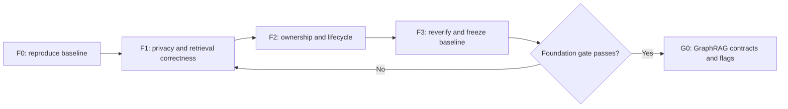
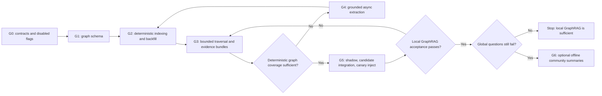
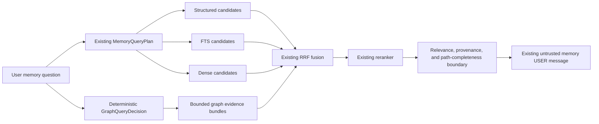

# GraphRAG and Phase 6 Fixes Implementation Plan

**Date:** 2026-09-15  
**Source:** `RAG_IMPLEMENTATION_AND_GRAPHRAG.md` sections 12–18.

This is the remediation and GraphRAG delivery plan from that document. It requires implementation and acceptance evidence.

GraphRAG is **not** implemented. It should be added **on top of** the existing hybrid stack rather than replacing it, as a **fourth candidate source** inside the existing fusion pipeline, using PostgreSQL graph tables with the same `user_id` ownership model. A Microsoft-style community GraphRAG (Leiden communities + global map-reduce) is optional later and is **not** the first step for a voice assistant.

---

## How the work is sequenced

GraphRAG must not be implemented directly on top of unresolved privacy, lifecycle, and fallback behavior. The Phase 6 fixes are part of the delivery sequence, but they remain separate from graph features so each correction can be reviewed, tested, and rolled back independently.





P0 means required before GraphRAG can influence retrieval. P1 must be resolved before production graph inject because graph traversal adds new database failure modes.

`memory_version` and richer conversation provenance do not need to block the earliest graph-schema experiment if graph data is driven directly by `source_memory_id`. They become mandatory before cache/community rebuild triggers or policies that depend on conversation provenance.

---

# Part 1 — Required Phase 6 remediation before GraphRAG

## 1. Mandatory fixes

| Priority | Current problem | Required code change | Primary files | Exit evidence |
|---|---|---|---|---|
| P0 | A live session-exclusion change updates PostgreSQL but not the gateway's cached metadata | Make extraction and retrieval consult a current owner-scoped exclusion state, or explicitly synchronize the active gateway snapshot. Decide and implement whether enabling exclusion also enqueues `purge_session` for existing automatic memories | `api/sessions.py`, `websocket/gateway.py`, `memory/repository.py`, `memory/jobs.py` | Live-toggle test, reconnect test, pending-job test, and retroactive-purge test if purge is adopted |
| P0 | Reranker failure keeps RRF candidates and skips `apply_relevance_boundary` | Apply a safe fallback boundary before returning degraded candidates. Dense nearest-neighbor hits must not become trusted merely because reranking failed | `memory/retrieval.py` | Embedding-outage and reranker-outage tests proving irrelevant injection remains zero |
| P0 | `PATCH /memories/{id}` works while `users.memory_enabled=false` | Apply the same per-user write guard used by create/tool writes while preserving list/get/delete/re-enable access | `api/memories.py` | Disabled-user create/update/search/delete behavior tests |
| P0 | Hybrid `/memories/search` ignores the request `limit` | Pass an explicitly bounded limit into retrieval or apply the requested limit consistently after retrieval without violating candidate/final caps | `api/memories.py`, `memory/retrieval.py`, possibly `memory/types.py` | GET/POST search tests for limits 1, default, 8, and 32 in off and hybrid modes |
| P0 | Graph-specific SQL failure could poison the shared request transaction | Before graph work, define the isolation pattern used by optional retrieval branches: a separate bounded read-only session or a tested savepoint/rollback boundary | retrieval/session boundary | PostgreSQL timeout/error test proving ordinary hybrid results still complete |
| P1 | PostgreSQL retrieval failures are not provider-style fail-open | Decide the product contract. If memory is an optional voice enhancement, isolate retrieval so a memory-query failure returns no/degraded memory without invalidating turn persistence | `websocket/gateway.py`, `memory/retrieval.py`, database session wiring | Database-error voice test and transaction-health assertion |

## 2. Lifecycle and ownership fixes

| Priority | Current problem | Required code change | Exit evidence |
|---|---|---|---|
| P0 | `supersedes_id` is a single-column FK and does not enforce same-user ownership in the database | Migrate to an owner-scoped supersession reference, normally `(supersedes_id, user_id) -> memory_items(id, user_id)`, while preserving existing rows | Migration test rejects cross-owner supersession and preserves valid history |
| P1 | `memory_version` is not maintained by ordinary mutations | Increment it transactionally for each committed logical create, superseding edit, delete, automatic extraction, and confirmed tool mutation. Define replay/dedupe behavior so retries do not over-increment | Version tests for create/update/delete/tool/worker replay |
| P1 | Confirmed `memory_save` omits available conversation provenance | Carry session and turn IDs and resolve/persist the source user message where available. Manual API memory remains explicitly provenance-free except for `source_kind=manual_api` | Tool-save provenance and ownership tests |
| P1 | `reembed_memory` is schema-valid but unsupported | Either implement its handler and idempotent scheduling or remove it in a deliberate migration. Do not leave indefinitely retrying unsupported jobs | Handler/removal tests and dead-letter regression test |
| P2 | Canonical entity rows can become orphaned | Keep user deletion fast; add optional background cleanup only after checking zero memory links, zero active incoming/outgoing edges, and no aliases that policy retains | Orphan-cleanup idempotency and concurrency tests |

## 3. Product decisions that must be explicit

These are not safe to “fix” by assumption:

1. **Operator write flag:** decide whether `MEMORY_WRITE_ENABLED` intentionally controls only automatic extraction/tools/workers or should also disable manual REST create/edit. Keep list/get/delete/re-enable available for user control.
2. **Session exclusion:** decide whether it is prospective only or retroactively removes automatic memories from that session. If retroactive, enqueue the existing `purge_session` job idempotently and never delete manual memories silently.
3. **Database failure:** decide whether a memory database-query failure produces no memory, degraded memory, or a failed voice turn. Graph-specific failures must never broaden the failure surface silently.
4. **No-result personal questions:** decide whether the LLM may answer from general knowledge or must emit a deterministic “no saved memory found” response.

Record these decisions in API/tool tests before GraphRAG implementation.

## 4. Foundation delivery phases

### Phase F0 — Reproduce the current baseline

Work:

1. Use the repository `.venv` Python 3.12 environment.
2. Run focused Phase 6 unit/contract tests and the PostgreSQL integration tests.
3. Run the complete backend non-regression suite.
4. Verify `alembic heads` from the checkout and `alembic current` against the target database. Static head at this audit is `0011_device_aware_task_times`; live database head is still a separate fact.
5. Verify PostgreSQL/pgvector, embedding, and reranker health.
6. Capture versioned hybrid quality and latency baselines using actual retained evidence artifacts.
7. Read feature flags from the running process, not only `.env` or defaults.

Exit gate: supported tests are reproducible, the live database revision and provider contracts are known, and baseline artifacts are stored with environment/model/corpus versions.

### Phase F1 — Fix privacy and retrieval correctness

Implement the P0 behavior fixes from section 1 in small independent changes: live session exclusion, safe reranker fallback, disabled-user edit protection, hybrid search limit propagation, and an isolated optional-retrieval failure boundary.

Exit gate: targeted tests pass for each fix; cross-user, disabled, excluded, deleted, superseded, no-result, and provider/database-outage cases show no irrelevant or unauthorized memory injection.

### Phase F2 — Fix ownership and lifecycle contracts

Implement the owner-scoped supersession FK and the agreed lifecycle fixes from section 2. Make any product decision from section 3 explicit in code, migration notes, API semantics, and tests.

Exit gate: migration upgrade tests preserve existing memory rows, cross-owner references are rejected by PostgreSQL, mutation/version/provenance behavior is deterministic under retry, and unsupported job types cannot loop unexpectedly.

### Phase F3 — Reverify and freeze the pre-graph baseline

Re-run focused, integration, full backend, evaluation, provider, and latency checks. Store a versioned “hybrid only” result set that will be used for graph-off equality and shadow comparison.

Exit gate: all mandatory remediation is green; the GraphRAG migration has not yet been applied; reviewers approve the frozen baseline and rollout thresholds.

---


# Part 2 — GraphRAG implementation plan

## 5. Why add GraphRAG here

Hybrid RAG is good at:

- “What do I prefer for tea?” (preference + FTS + dense)
- Exact names, codes, rare tokens (FTS)
- Paraphrases (“I like working from home” vs “I work remotely”) (dense)

Hybrid RAG is weak at **connected personal questions**:

- “Who in my family lives in Mumbai?”
- “When did I last visit the city where Rahul works?”
- “What projects is Priya connected to?”
- “How is Acme related to my laptop preference?” (multi-hop)

Those need:

1. Named entities with stable IDs
2. Typed relations between entities (and/or memories)
3. Bounded neighborhood / path retrieval
4. Provenance back to the original memory text (never invent graph facts)

That is GraphRAG **for a personal assistant**, not Microsoft’s default “index a 10k-page corpus into communities.”

## 6. Recommended GraphRAG shape

Do **not** replace hybrid RAG. Do **not** introduce Neo4j as a second source of truth.

Stay in PostgreSQL, reuse composite `user_id` FKs, and feed graph-discovered source evidence into the existing ranking/context path. A direct graph hit can behave like a fourth RRF source; a multi-hop path must additionally preserve its complete supporting-memory bundle through final selection.

```text
query
  │
  ├── structured SQL candidates          (already exists)
  ├── FTS candidates                     (already exists)
  ├── dense / pgvector candidates        (already exists)
  └── graph neighborhood candidates      (NEW)
          ↓
     RRF fusion (existing fuse_candidates)
          ↓
     BGE reranker (existing)
          ↓
     relevance boundary + assemble_context
          ↓
     untrusted <memories> USER message   (unchanged)
```

This is the smallest change that preserves:

- voice prompt construction
- tool loop
- ownership / deletion / supersession
- shadow / inject / off rollout
- fail-open provider behavior



### 6.1 What GraphRAG means in three layers

| Layer | Purpose | Voice latency |
|---|---|---|
| **Local graph search (do this first)** | Seed entities from the query → 1–2 hop neighbors → linked memories as candidates | Acceptable if hop limit is 1–2 and candidate cap is small |
| **Path / multi-hop (second)** | Explicit relation questions (“who reports to X”, “where did I visit with Y”) | Only when `GraphQueryDecision` enables a bounded graph path |
| **Global / community GraphRAG (later, optional)** | Hierarchical community summaries for “tell me about my work life” | Must be **offline**. Never run Leiden + map-reduce on a live voice turn |

Microsoft GraphRAG’s community detection + global search is useful for large document corpora. A single user’s memory store is small and highly structured. Local graph search plus the existing hybrid stack covers almost all personal-assistant questions. Community summaries can be added later as another memory type (`summary`) produced by a background job.

---

## 7. GraphRAG delivery phases

### Phase G0 — Contracts and disabled feature flags

**Goal:** introduce inert graph contracts without changing database schema, retrieval results, prompts, or voice behavior.

Work:

1. Add `MEMORY_GRAPH_RETRIEVAL_MODE=off|shadow|inject`, default `off`.
2. Add `MEMORY_GRAPH_WRITE_ENABLED=false`, independent of graph reads.
3. Keep `MEMORY_RETRIEVAL_MODE=off` as the master retrieval-off switch.
4. Add bounded settings for query entities, edges per entity, traversal depth, paths, graph memories, and graph timeout.
5. Add a deterministic `GraphQueryDecision` beside—rather than inside—the existing `MemoryQueryPlan` for the initial rollout.
6. Define checked DTOs for `EntityType`, `RelationshipType`, `GraphPath`, `GraphEvidenceBundle`, graph skip/fallback reasons, and graph-job payloads.
7. Add configuration validation and safe defaults. Do not initialize a graph provider or modify the prompt.

Recommended initial bounds:

```text
max query entities = 3
max edges per entity = 10
max traversal depth = 2
max paths = 20
max graph-derived source memories = 10
graph timeout = calibrated from PostgreSQL evidence; 50 ms is only a starting hypothesis
```

Exit gate: with both graph flags at their defaults, current hybrid queries, tool results, prompt messages, and latency traces are byte/semantically equivalent except for explicitly approved inert configuration metadata.

### Phase G1 — Real graph schema (still PostgreSQL)

The current model is **star-shaped**: Memory —link→ Entity. Multi-hop needs **entity–entity** (or memory-as-edge) records.

Add tables (same ownership pattern as `0007`):

```text
entity_aliases
  id, user_id, entity_id, alias, normalized_alias
  source_memory_id NULL, source_kind, created_at
  UNIQUE (user_id, entity_id, normalized_alias)
  INDEX (user_id, normalized_alias)      -- lookup may return ambiguous candidates
  composite FK (entity_id, user_id)
  composite FK (source_memory_id, user_id) when source_memory_id is present

entity_relationships                     -- the actual graph edges
  id, user_id
  source_entity_id, target_entity_id
  relationship_type  -- checked controlled vocabulary
  source_memory_id   -- provenance; required
  valid_from, valid_to                    -- optional
  confidence, status, extraction_policy_version
  UNIQUE (user_id, source_entity_id, target_entity_id,
          relationship_type, source_memory_id)
  composite FKs on both entities + memory, all with user_id

entity_embeddings (optional)
  entity_id, user_id, embedding VECTOR(1024)
  -- for fuzzy entity linking of spoken names
```

Formalize `entities.entity_type`, which is currently an unconstrained string populated as `"subject"`, into a checked set, for example:

`self | person | place | organization | project | product | event | other`

Create exactly one owner-scoped `self` entity per user when graph writing/backfill first needs it. This is required to represent first-person evidence such as “Rahul is my colleague” as `SELF --COLLEAGUE_OF--> Rahul`; the current extractor's object value `"colleague"` is a role, not a target entity.

The migration must map existing `"subject"` rows safely (normally to `other` until re-extracted) before adding the check constraint. Do not assume an alias is globally unique for a user: two people or places may share the same normalized alias, so seed resolution must retain multiple bounded candidates or use type/context evidence.

Start with a reviewed relationship vocabulary that matches personal memory, for example `COLLEAGUE_OF`, `FRIEND_OF`, `FAMILY_OF`, `WORKS_AT`, `WORKS_ON`, `LIVES_IN`, `LOCATED_AT`, `OWNS`, `MEMBER_OF`, `MANAGES`, `REPORTS_TO`, `DEPENDS_ON`, and `RELATED_TO`. Define direction and inverse-query behavior for each relation. Unknown strings are rejected or mapped only through a versioned deterministic rule; model-generated free text never becomes schema semantics.

Keep **PostgreSQL recursive CTEs** for hops:

```sql
WITH RECURSIVE neighborhood AS (
  SELECT entity_id, 0 AS hop
  FROM seed_entities
  WHERE user_id = :user_id
  UNION ALL
  SELECT ... hop + 1
  FROM entity_relationships
  JOIN neighborhood ...
  WHERE hop < :max_hops          -- 1 or 2
)
SELECT DISTINCT source_memory_id FROM ...
```

Hard rules:

- Every graph SQL includes `user_id`.
- Every edge has `source_memory_id` provenance. No edge without a source memory.
- Deleting a memory cascades or tombstones its edges.
- Max hops 2 on the voice path. Hard candidate cap (same `memory_candidate_count`).
- Cycle protection in the CTE using a visited-entity path, not only a hop counter.
- Graph retrieval joins back to an active owned source memory even when edge status is active, preventing lifecycle drift from exposing deleted/superseded evidence.
- Alias rows without `source_memory_id` are allowed only for an explicitly defined manual/system source kind; evidence-derived aliases require memory provenance.

The migration must also extend `ck_memory_jobs_type` for the deterministic graph-indexing job introduced in G2. At implementation time, confirm the actual next Alembic revision. Static repository head at this audit is `0011_device_aware_task_times`, so `0012_graph_rag_foundation` is the expected name only if the live/repository chain has not advanced.

Optional later: Apache AGE inside the same Postgres if CTE hops become awkward. **Not required for G1.**

Exit gate: migration upgrade/downgrade tests preserve existing entities and memory links; PostgreSQL rejects cross-owner aliases, relationships, provenance, and supersession; uniqueness/check/index contracts are verified on representative data; graph flags remain off.

### Phase G2 — Deterministic graph indexing and backfill

**Goal:** populate trustworthy graph data from fields already stored on active memories, without adding an LLM call.

Add a dedicated package boundary such as:

```text
backend/app/graph/
  types.py          checked graph DTOs and enums
  repository.py     ownership-scoped SQL only
  resolver.py       canonical-name and exact-alias resolution
  indexing.py       memory-to-graph deterministic mapping
  traversal.py      bounded one-hop/two-hop reads
  policy.py         relationship/provenance/lifecycle rules
  service.py        facade used by memory retrieval and jobs
```

Do not plan changes against nonexistent `memory/worker.py`, `memory/service.py`, or `memory/rrf.py`; current equivalents are `memory/jobs.py`, `memory/worker_service.py`, `memory/retrieval.py`, and `memory/fusion.py`.

Work:

1. Add durable job type `index_memory_graph` to Python and the database check constraint.
2. When `MEMORY_GRAPH_WRITE_ENABLED=true`, a newly created memory enqueues `index_memory_graph` idempotently in the same transaction. Graph-job failure must never invalidate or delete the memory.
3. The worker loads the owned active memory and maps only supported structured fields into reviewed entities/relationships.
4. Use the existing `memory_type`, `subject`, `predicate`, `object_json`, and `memory_entities` link when—and only when—the deterministic policy can establish both endpoint semantics.
5. Do not assume today's regex extractor produces `works_on`, locations, or object entities. For “Rahul is my colleague,” map through the explicit `self` policy; otherwise skip unsupported predicates and record a sanitized reason.
6. Create a deterministic edge identity from owner, endpoints, relationship type, source memory, and policy version; retries produce one edge.
7. Add a restartable batched backfill over active owned memories. It must not change memory IDs/content, chunks, embeddings, FTS, dedupe keys, provenance, or supersession state.
8. Integrate lifecycle: a deleted source removes derived edges and evidence-only aliases; a superseded source is never current graph evidence; disabling memory stops new graph jobs and graph reads.
9. Add optional orphan cleanup as background housekeeping, not as a prerequisite for the user's delete request.

Exit gate: new and backfilled eligible memories produce identical graph records under replay/concurrency; unsupported memories safely produce no edge; graph writes remain off by default; current hybrid results are unchanged.

### Phase G3 — Deterministic routing, bounded traversal, and complete evidence

**Goal:** prove graph retrieval in isolation before it participates in RRF or prompts.

Work:

1. Build `GraphQueryDecision` deterministically from the normalized query without changing `MemoryQueryPlan` or calling another model.
2. Resolve at most the configured number of exact canonical names and validated aliases. Ambiguous aliases return multiple bounded candidates or require type/context evidence; never merge silently.
3. Implement owner-scoped one-hop and cycle-safe two-hop traversal with hard limits on edges, paths, depth, and returned memories.
4. Return an ordered `GraphEvidenceBundle` per path containing relationship metadata, hop count, confidence, and **all active supporting source-memory IDs**.
5. Fetch the original source-memory texts. Graph syntax alone is not sufficient prompt evidence, and a multi-hop conclusion is never persisted as a new fact without direct evidence.
6. Preserve path completeness during ranking. Rerank a bounded path representation, then keep/inject its supporting source memories as a unit; independently reranking each edge memory may drop half of the proof.
7. Execute graph SQL behind an enforced deadline in an isolated read boundary. A timeout/error must be rolled back without poisoning the session/transaction used by ordinary hybrid retrieval.
8. Add cancellation checks before lookup, during/after traversal, before reranking, and before candidate publication; late graph results never reach a superseded `response_id`.

Initial router examples:

| Query | Decision |
|---|---|
| “Who works with Rahul?” | Graph, depth 1 |
| “Who is testing the project Rahul works on?” | Graph, depth 2 |
| “What did I save about Project Alpha?” | Hybrid only unless exact graph lookup is explicitly useful |
| “What is my favorite drink?” | Hybrid only |
| “What is my latest preference?” | Structured/hybrid only |

Exit gate: isolated PostgreSQL tests pass for one-hop, reverse lookup, two-hop, ambiguity, cycles, bounds, deletion, supersession, cancellation, timeout rollback, and two-user isolation. Retrieval still does not alter RRF or prompt context.

### Phase G4 — Coverage gate and graph-aware extraction (only if needed)

A graph with only regex `subject` nodes will be sparse and wrong.

First measure deterministic indexing coverage. If it is sufficient for the accepted use cases, skip this phase and proceed to G5. If it is insufficient, add a **versioned** extraction policy, for example `graphrag-extraction-v1`, as a new job type or an extra stage after `extract_turn`. Do not call it `phase7-*`; Phase 7 in this repository already covers tasks and reminders.

```text
extract_turn (existing regex, keep)
  → write MemoryItem as today
  → enqueue extract_graph job
       → NER / relation extract (LLM or local NER)
       → validate: every span must be grounded in the user-authored source evidence
       → upsert entities + aliases
       → insert entity_relationships with source_memory_id provenance
       → optional embed entities
```

If `extract_graph` is a new durable job type, a follow-up migration must update the database `ck_memory_jobs_type` constraint as well as `MemoryJobType` and `MemoryJobWorker`; changing only the Python enum is insufficient.

Constraints inherited from Phase 6 (do not weaken):

- Only user-authored evidence is eligible: a final user message, confirmed explicit-memory text, or manual memory content. Assistant text and tool result JSON never become facts.
- Reject secrets, hearsay, uncertainty, temporary markers.
- Ground every entity span in source text (`validate_candidate` equivalent).
- Confidence / salience floors.
- Idempotent jobs.
- Policy version on every row so bad graph extractors can be rolled back.

Do **not** put LLM graph extraction on the voice critical path. Same as today’s embed job.

Do not use this extractor as a query router. `GraphQueryDecision` remains deterministic. Re-run backfill for the new extraction-policy version, then repeat all G2/G3 gates before shadow integration.

Exit gate: extraction quality, grounding, wrong-edge rate, provenance, retry behavior, rollback, and cross-user isolation pass on a versioned corpus; no graph model call occurs on the voice read path.

### Phase G5 — Shadow, candidate integration, and canary inject

Graph hits must prove quality and latency without drowning lexical/dense hits.

#### G5a — Shadow

Run decision, entity resolution, traversal, source-memory fetch, and bundle ranking, but do **not** add graph candidates to RRF, reranker inputs, REST results, tool results, context, or the LLM response. Record sanitized counts, timings, fallback reasons, path completeness, and evaluation-only identifiers in restricted evidence—not private relationship text in ordinary logs.

Compare hybrid-only and graph-shadow results on the same versioned query corpus. Required categories include direct/reverse relationships, two-hop paths, exact/known/unknown/ambiguous aliases, multiple entities with the same name, cycles, deleted/superseded evidence, timeout, ordinary hybrid queries, temporal queries, prompt-injection memories, disabled users, and two-user isolation.

Shadow exit gate: graph invocation precision, relationship/multi-hop accuracy, source-memory precision, wrong-edge rate, latency, timeout/fallback rate, and all zero-tolerance privacy gates meet agreed thresholds. Hybrid outputs remain identical.

#### G5b — Candidate and evidence integration

Extend `MemoryCandidate.source` from `"structured"|"fts"|"dense"` to include `"graph"`. Convert accepted bundles into ranked graph-source candidates before `fuse_candidates`, but preserve bundle identity through reranking and final selection so all evidence required by an accepted path remains available. Graph scores rank the graph source; never add raw graph confidence directly to FTS or cosine scores.

Use the existing reranker on bounded path representations/source text. Do not automatically mark all graph hits as trusted. A direct exact-seed link may be boundary-eligible; multi-hop and model-extracted paths must clear graph-specific relevance/provenance policy.

Recommended graph participation policy:

| Query class | Graph behavior |
|---|---|
| `RELATIONSHIP` / explicit “who/where is X related” | Run graph. A direct exact-seed link may be boundary-eligible; multi-hop or model-extracted results must still clear rerank/relevance checks |
| Named-entity present in `entities` | Run 1-hop graph |
| Broad `GENERAL` | Skip graph (same reason structured is skipped) |
| `TIME_RANGE` | Graph optional; still prefer structured temporal SQL |

Latency budget on the voice path:

- Graph SQL must be cheaper than one embedding call.
- Do **not** call the LLM to extract entities at retrieve time.
- Seed matching = normalized string + optional small entity-embedding kNN, not a full document embed.
- Never concurrently use the same `AsyncSession`. Use the isolated read boundary proven in G3 if graph work overlaps remote embedding; measure database-pool pressure and cancellation.
- If graph retrieval exceeds its calibrated budget, enforce the deadline, roll back/close the graph read boundary, record a graph-specific degraded reason, and continue with hybrid-only. A prose budget without enforcement and transaction recovery is insufficient.

`memory_search` tool automatically benefits once `MemoryRetrievalService.retrieve` includes graph. REST `/memories/search` does too.

#### G5c — Canary inject and rollout

Enable `inject` only for controlled users/cohorts after shadow acceptance. Run the complete hybrid, auth, memory lifecycle, tool, cancellation, task/reminder, LLM streaming, TTS, and barge-in non-regression suite plus physical multi-hop voice cases. Expand incrementally while monitoring invocation, no-result, timeout/fallback, wrong-edge, latency, and privacy metrics. `MEMORY_GRAPH_RETRIEVAL_MODE=off` remains the permanent kill switch.

Exit gate: graph-off equals the frozen F3 baseline; graph inject improves accepted relationship/multi-hop metrics; no zero-tolerance gate regresses; physical voice validation passes; rollback to off is verified.

### Phase G6 — Optional global GraphRAG (community summaries)

Only after local graph search is accepted.

Prerequisite: make `memory_version` advance transactionally on every successful memory create, superseding edit, delete, automatic extraction, and confirmed tool write. It is not currently reliable enough to drive rebuilds.

Offline worker per user (triggered after enough versioned changes):

1. Build the user’s entity graph
2. Cluster (Leiden or simpler connected-components for small graphs)
3. LLM-summarize each community into `memory_items` with `memory_type=summary` and provenance metadata
4. Embed those summaries into the **existing** chunk index

Generated community summaries must carry a graph/extractor version and source marker, must not be fed back into entity/relation extraction or community clustering, and must be replaced idempotently so they cannot recursively summarize earlier generated summaries.

At query time, global questions retrieve those summaries through **dense + FTS**, not by running clustering live.

This reuses hybrid RAG instead of adding a second answer generator.

---

## 8. Extension points in today’s code (exactly where to plug in)

These are the stable seams. GraphRAG should stop at these boundaries.

| Seam | File | Why it is the hook |
|---|---|---|
| Candidate source list | `MemoryRetrievalService.retrieve` after ordinary sources and before `fuse_candidates` | Add graph only in G5 inject; graph-off/shadow must not change fusion |
| Candidate/path DTOs | `MemoryCandidate.source` plus new graph DTOs | Add `"graph"` while preserving multi-memory bundle identity through selection |
| Query decision | New deterministic `GraphQueryDecision` adjacent to `MemoryQueryPlan` | Avoid changing current planner semantics during initial rollout |
| Optional provider | Graph service construction + `main.py` lifespan only if entity embeddings are later approved | Exact canonical/alias resolution needs no new provider initially |
| Write | `MemoryWriter.write_candidate` completion boundary | Enqueue an idempotent graph-index job; do not synchronously construct graph edges on the voice/API request |
| Jobs | `MemoryJobType`, database job check, `MemoryJobWorker` in `memory/jobs.py` | `index_memory_graph`; later `extract_graph` / community rebuild only when approved |
| Graph implementation | New `backend/app/graph/` package | Keep ownership SQL, resolution, indexing, traversal, scoring, and policies out of `VoiceGateway` |
| Context | Existing `assemble_context` / `build_voice_llm_request` | Continue injecting bounded original source-memory text as untrusted USER data; path selection happens before assembly |
| Tools | **Do not duplicate** | `memory_search` already calls `retrieve` |
| Rollout | Existing retrieval-mode pattern | Separate graph read/write flags; start `off`, build deterministically, shadow, then canary inject |
| Ownership | composite `(id, user_id)` FKs | Copy this for every new graph table |
| Failure isolation | Database/session factory + graph service | A graph timeout/error must roll back its own read boundary and leave hybrid retrieval usable |

Gateway retrieve path that must keep working:

```text
VoiceGateway._memory_context_for_transcript
  → MemoryRetrievalService.retrieve
  → assemble_context
  → build_voice_llm_request
```

---

## 9. What not to do

1. **Do not replace** structured + FTS + dense with graph-only retrieval. Graph is complementary.
2. **Do not add Neo4j / Neptune as the memory source of truth.** PostgreSQL already holds memories, embeddings, and ownership. A second store will leak, drift, and break delete-all.
3. **Do not run Microsoft GraphRAG global search on every voice turn.** Community map-reduce is too slow and too expensive for barge-in / TTFT.
4. **Do not extract a graph from assistant text or tool JSON.** Same Phase 6 rule: user evidence only.
5. **Do not put graph edges in the system prompt.** Same untrusted `<memories>` envelope, or a sibling `<graph>` USER block with the same warning.
6. **Do not skip `user_id` on graph queries.** Cross-user graph traversal is a privacy incident.
7. **Do not allow unbounded hops.** Personal graphs are dense; “friend of friend of friend” will retrieve almost everything.
8. **Do not block TTS on graph LLM extraction.** Extraction stays in `memory_jobs`.
9. **Do not treat graph edges as ground truth if the source memory was superseded or deleted.** Edges must follow memory lifecycle.
10. **Do not modify `VoiceGateway` with node/edge/path logic.** The gateway continues asking the memory layer for context.
11. **Do not concurrently run graph and hybrid SQL on the same `AsyncSession`.** Optional parallelism requires a separate bounded read session and pool/cancellation tests.
12. **Do not let independent reranking drop part of an accepted multi-hop proof.** Preserve all source memories required by the selected evidence bundle.
13. **Do not hide Phase 6 remediation inside a graph change.** Land F1/F2 fixes independently and freeze the F3 baseline before graph schema work.

---

## 10. End-to-end implementation sequence

| Order | Phase | Deliverable | Must be true before continuing |
|---:|---|---|---|
| 1 | F0 | Reproducible supported environment, live/static revision check, focused/integration/full tests, provider health, retained hybrid quality/latency baseline | Current state is measurable and evidence is retained |
| 2 | F1 | Session-exclusion coherence, safe reranker fallback, disabled-user edit guard, hybrid search limit, isolated optional-retrieval errors | Privacy/retrieval correctness tests pass independently |
| 3 | F2 | Owner-scoped supersession and agreed version/provenance/job/lifecycle changes | Migration and retry/concurrency tests pass |
| 4 | F3 | Frozen post-fix hybrid-only corpus results and latency baseline | Reviewers approve the foundation gate |
| 5 | G0 | Inert graph contracts, bounds, and read/write flags defaulted off | Graph-disabled behavior equals F3 |
| 6 | G1 | PostgreSQL aliases/relationships, `self` policy, controlled types, provenance, constraints, indexes, graph job type | Migration and two-user ownership tests pass |
| 7 | G2 | Deterministic graph indexing job, lifecycle hooks, idempotent batched backfill, orphan housekeeping | Eligible memories index correctly; unsupported memories safely skip |
| 8 | G3 | Deterministic graph decision, exact/alias resolution, bounded one/two-hop traversal, complete evidence bundles, isolated timeout/cancellation | Repository/traversal tests pass; no RRF/prompt changes yet |
| 9 | G4 | Optional grounded async graph extraction only when deterministic coverage is insufficient | New policy passes quality/provenance gates, then G2/G3 are rerun |
| 10 | G5a | Shadow execution and versioned graph evaluation | Hybrid output equality and shadow thresholds pass |
| 11 | G5b | Bundle-aware graph candidate integration with existing RRF/reranker/context | Hybrid regression and path-completeness tests pass |
| 12 | G5c | Controlled physical canary, monitored rollout, verified kill switch | All local GraphRAG acceptance gates pass |
| 13 | G6 | Optional offline community summaries | Only considered if accepted local graph still fails global questions |

### Acceptance gates to copy from Phase 6

- cross-user leakage = 0
- deleted memory retrieval = 0
- superseded memory not injected
- no-result irrelevant injection = 0
- retrieved graph text remains inert as instructions (adversarial memory cases)
- direct and multi-hop graph candidates retain active source-memory provenance
- every accepted multi-hop answer retains all source memories required by the path
- alias ambiguity never merges distinct entities silently
- hop and candidate caps hold under cycles and dense personal graphs
- session exclusion and per-user disablement apply to graph extraction/retrieval
- provider or graph-timeout degradation does not bypass the intended relevance policy or leave the hybrid database transaction unusable
- graph-off results equal the frozen F3 hybrid baseline
- graph writes, backfill, and optional extraction never block a voice turn
- cancellation and superseded `response_id` produce zero late graph output
- `memory_version` advances exactly once per committed logical mutation/replay policy
- P95 retrieve budget is measured and enforced before inject mode (graph SQL included)
- full auth/device/voice/STT/memory/tool/task/reminder/LLM/TTS/barge-in non-regression suite passes before production expansion

---

## 11. Bottom line

**First repair Phase 6 by:** reproducing the baseline; fixing privacy/retrieval correctness; strengthening ownership/lifecycle contracts; then freezing a new hybrid-only baseline.

**Then add GraphRAG by:** introducing inert contracts/flags; adding a PostgreSQL-local graph with `self`, typed entities, aliases, and provenance-bearing relationships; deterministically indexing and backfilling eligible memories; retrieving bounded one/two-hop evidence bundles; shadowing; integrating bundles with the existing RRF/reranker/context path; and enabling canary inject only after acceptance. Rich model extraction and community summaries remain optional later phases.

That is GraphRAG that fits a voice personal assistant, not a second unrelated RAG product.
