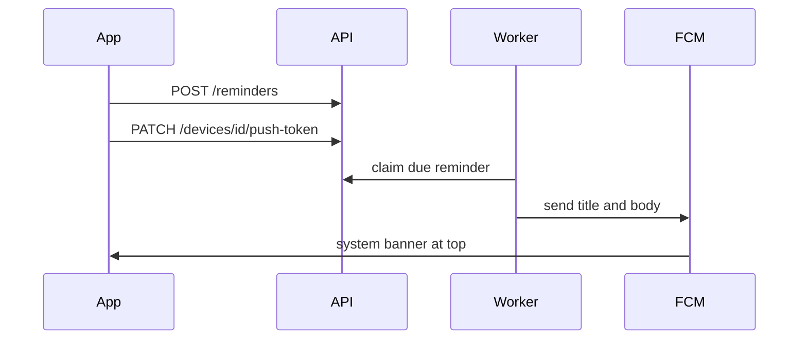

# Android reminder push notifications

## What is already true

Reminders work up to the last mile. Voice and the tasks screen write a `reminders` row (`scheduled`, `delivery_channel=push`). [backend/app/reminders/worker.py](backend/app/reminders/worker.py) claims due rows and looks up `devices.push_token`. [backend/app/services/push_delivery.py](backend/app/services/push_delivery.py) always uses `UnavailablePushDeliveryProvider`, so the row becomes `failed` with `push_provider_unconfigured`. If no token exists, it fails with `no_active_push_device`.

The app only asks for Android `POST_NOTIFICATIONS` in [frontend/src/screens/TasksScreen.tsx](frontend/src/screens/TasksScreen.tsx). It never gets a Firebase token and never calls `PATCH /devices/{id}/push-token`, even though login already returns `device.id`.

There is no web or iOS push path. Scope is Android only (`com.voiceaipoc`). Tasks do not send their own notifications; only reminders do.

## Cost choice

Firebase Cloud Messaging has no per-message fee for this use. That is the same class of notification as Amazon: a high-priority Android notification that appears as a banner at the top and stays in the drawer. On-device alarms are also free, but they skip the worker that already owns retries, recurrence, and multi-device delivery. FCM is the path.

## What we need from you

Code can land first and keep the current no-op provider until these files exist. Do not commit them.

- A free Firebase project at https://console.firebase.google.com
- Android app registered with package name `com.voiceaipoc`
- `google-services.json` placed at `frontend/android/app/google-services.json` (gitignored)
- Cloud Messaging API (HTTP v1) enabled, plus a service-account JSON with permission to send FCM messages
- Backend env var pointing at that JSON, for example `FCM_SERVICE_ACCOUNT_FILE` (gitignored)
- One physical Android phone, or an emulator image that includes Google Play, signed in with a Google account, to confirm a banner actually appears

Without those files, reminders will keep failing the same way they do now.

## Backend

- Add `FcmPushDeliveryProvider` in [backend/app/services/push_delivery.py](backend/app/services/push_delivery.py) that implements the existing `send(token, delivery_id, title, body)` contract.
- Call the FCM HTTP v1 API with `httpx` (already a dependency). Use a short-lived OAuth token from the service account. Send a high-priority Android notification (`priority: HIGH`, channel `reminders`) so the banner can show while the app is closed. Put `delivery_id` in data for dedupe.
- Settings in [backend/app/core/config.py](backend/app/core/config.py): service-account file path. If the file is missing, keep `UnavailablePushDeliveryProvider`. If it is present, pass the FCM provider into the worker in [backend/app/main.py](backend/app/main.py) and [backend/app/reminders/worker_main.py](backend/app/reminders/worker_main.py).
- Map FCM results: success means delivered; `UNREGISTERED` / invalid token clears that device token and is permanent for that device; timeouts and 5xx stay retryable so the existing backoff still applies. Never log the raw token.
- Tests use a fake HTTP client, same style as `FakePushDeliveryProvider`. Existing worker tests stay on the fake provider.
- Reminders already marked `failed` will not fire again. After push works, reschedule rows whose `failure_code` is `push_provider_unconfigured` or `no_active_push_device` and whose `trigger_at` is still in the future back to `scheduled`. Leave past ones failed.

## Android app

- Add `@react-native-firebase/app`, `@react-native-firebase/messaging`, and `@notifee/react-native` (all free). Apply the Google Services Gradle plugin. Notifee creates a high-importance `reminders` channel and shows the banner when the app is in the foreground; FCM shows it when the app is in the background or closed.
- After login, and again when the FCM token rotates: request `POST_NOTIFICATIONS` on Android 13+, call `getToken()`, then `PATCH /devices/{device.id}/push-token` using the device from the auth response. On logout, send a null token so the worker stops targeting that device.
- Keep the existing permission card on the tasks screen. Update its copy so it matches real delivery: permission granted and token registered means reminders can appear at the top; denied means the reminder is stored and will not notify.
- Ignore duplicate `delivery_id`s if the same push is delivered twice.

## Docs and checks

- After the code change, add a markdown note under `docs/` named with the date, time, and a short title, listing files touched.
- Verify with unit tests for the FCM adapter and token registration. A real banner on a phone can only be confirmed after the Firebase files above are in place. Do not rebuild the whole web/api/admin stack; this repo’s client is the React Native app.
