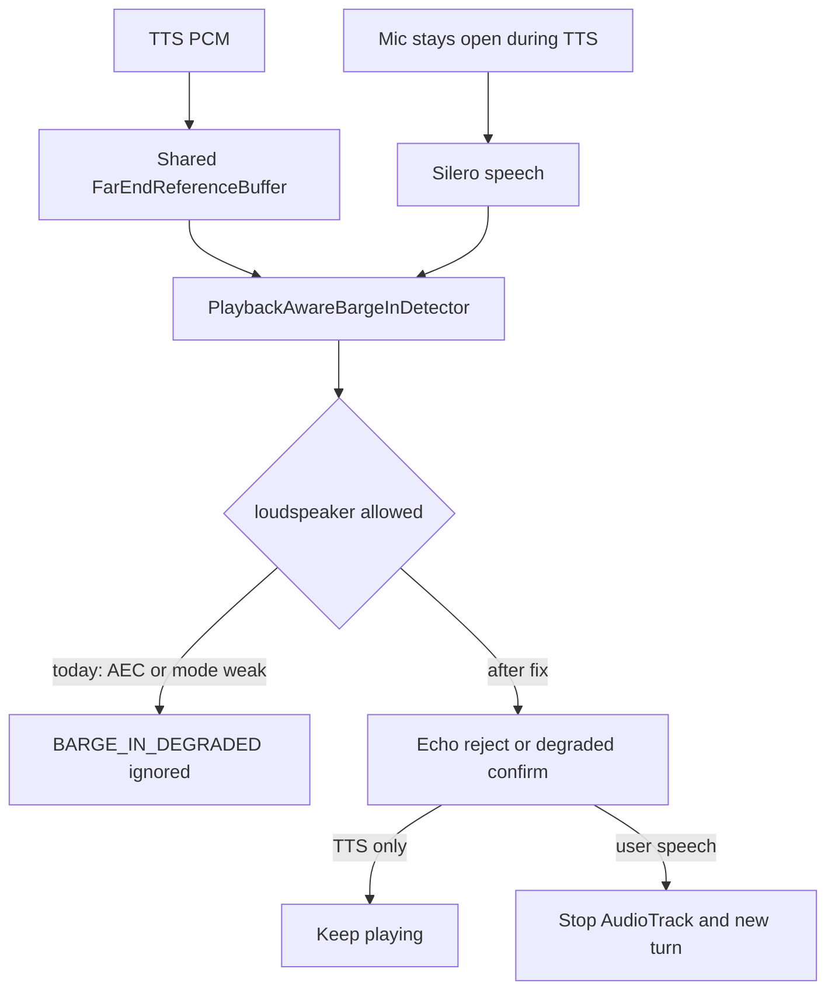
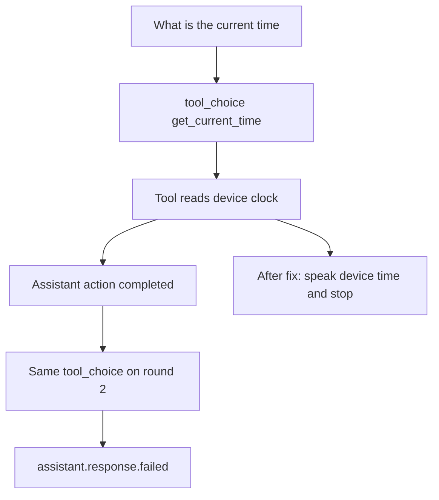

# Permanent barge-in and device clock fixes

Two independent failures. Do not treat TTS playback as a user transcript, and do not ask the model to invent the time.

## 1. Barge-in

Today, [frontend/android/app/src/main/java/com/voiceaipoc/rn/VoiceModule.kt](frontend/android/app/src/main/java/com/voiceaipoc/rn/VoiceModule.kt) `currentBargeInRouteHealth()` sets `automaticLoudspeakerBargeInAllowed` only when the route is not a speaker, or when `MODE_IN_COMMUNICATION` and AEC are both healthy. The default route is the loudspeaker (`AudioConfig.communicationDevicePreference = SPEAKER`). On that route the detector returns `BARGE_IN_DEGRADED` / `no_safe_acoustic_path` at the top of `PlaybackAwareBargeInDetector.evaluate()` and never reaches echo rejection or confirmation.

[frontend/src/voice/VoiceSocket.ts](frontend/src/voice/VoiceSocket.ts) `handleNativeBargeInEvent` acts only on `BARGE_IN_CONFIRMED`. Native stop in `VoiceModule.emitSileroVadEvent` is also confirmed-only. Degraded events are logged and ignored, so TTS keeps playing and the interruption is never uploaded.

TTS audio is already the barge-in reference. `VoiceModule` passes one `FarEndReferenceBuffer` into both `VoiceWebSocketTransport` and `AudioEngine`. `onPcmWritten` stores speaker PCM; the mic path calls `assess()` on that same buffer. That comparison is what tells user speech from the assistant. Leave this wiring unchanged.

A second delay remains after the gate is removed. `BargeInConfig.playbackGuardMs` is 1200 ms, and `VOICE_EARLY_BARGE_IN_ENABLED` defaults to false in [frontend/android/app/build.gradle](frontend/android/app/build.gradle). `isInGuard()` refuses confirmation during that window, and `SPEECH_STOPPED` clears the segment. A short command in the first second of playback is discarded even when the route gate would allow it. `earlyBargeInEnabled` already caps that guard at 250 ms; the detector test `earlyBargeInShortensOnlyThePlaybackGuard` covers that behavior.

### Code change

In `currentBargeInRouteHealth()`, set:

`automaticLoudspeakerBargeInAllowed = rolloutConfig.automaticLoudspeakerBargeInEnabled`

Keep reporting `communicationModeActive`, `aecAvailable`, `aecEnabled`, and `aecEffectiveness` unchanged. The detector already uses those for `strictFallback` (probability 0.90, confirmation 640 ms) when AEC or the TTS reference is weak. Echo rejection in `isEchoDominant()` still runs before confirmation, so speaker bleed that matches the TTS reference cannot become a user turn.

Turn the early-barge-in default on: `voiceBooleanProperty("voiceEarlyBargeInEnabled", true)` in `build.gradle`, and `earlyBargeInEnabled: Boolean = true` on `VoiceRolloutConfig`. Do not change echo thresholds, do not enable WebRTC AEC3, and do not change the JS cancel / pre-roll lifecycle.

### Tests

In [frontend/android/app/src/test/java/com/voiceaipoc/vad/PlaybackAwareBargeInDetectorTest.kt](frontend/android/app/src/test/java/com/voiceaipoc/vad/PlaybackAwareBargeInDetectorTest.kt):

- Speaker route with `automaticLoudspeakerBargeInAllowed = true`, AEC unavailable, reference ready, near-end residual above the minimum, sustained for at least `degradedConfirmationMs`: expect `BARGE_IN_CONFIRMED`.
- Same route with high echo similarity, low residual, and far-end energy above the mic: expect `BARGE_IN_REJECTED_ECHO`, never confirmed.
- Keep `unsafeLoudspeakerRouteDisablesAutomaticBargeInWithExplicitReason` for the case where the rollout flag itself is off (`automaticLoudspeakerBargeInAllowed = false`).

Update [frontend/android/app/src/test/java/com/voiceaipoc/rollout/VoiceRolloutConfigTest.kt](frontend/android/app/src/test/java/com/voiceaipoc/rollout/VoiceRolloutConfigTest.kt) so the default config expects early barge-in enabled.

## 2. Device date and time

The device clock is already sent (`device_epoch_ms`, IANA timezone, UTC offset) and [backend/app/llm/tool_loop.py](backend/app/llm/tool_loop.py) `_current_time` / `_current_date` already format it with `format_local_time`. The gray “Assistant action completed” line is that success. The red “The assistant could not respond. Try again.” is the follow-up.

[backend/app/llm/context.py](backend/app/llm/context.py) `classify_voice_tool_choice()` forces `tool_choice` to `get_current_time` or `get_current_date`. After the tool result is appended, `LLMToolLoop.stream` copies the request with only `messages` updated, so the named choice survives. A named choice requires another tool call and does not allow a spoken answer. The gateway then emits `assistant.response.failed`. `llm_incomplete_response` is unmapped in [frontend/src/voice/conversation.ts](frontend/src/voice/conversation.ts) and falls back to that exact red string; `llm_provider_error` uses the same string. `FakeLLMService` hides this by returning text whenever any tool message is present, and [backend/tests/test_llm_tool_loop.py](backend/tests/test_llm_tool_loop.py) never asserts follow-up `tool_choice`.

### Code change

After a successful tool round in `LLMToolLoop.stream`, before the next provider call:

- If every completed call is `get_current_time` or `get_current_date` and the result JSON is ok, do not call the model again. Yield `tool_execution_completed` as today, then yield `text_delta` and `response_completed` with a sentence built only from the tool result. The existing gateway path already forwards `text_delta` to `assistant.text.delta` and TTS.
- Spoken form, using the fields `format_local_time` already returns: time becomes `The current time is {local_time}.` and date becomes `Today's date is {local_date}.` Example fields are `7:17 PM` and `22 September 2026`. If both tools ran in one round, speak both sentences. If the result JSON cannot be read, fall through to the continuation below instead of failing the turn.
- For every other tool continuation, set `tool_choice` to `"auto"` in the same `model_copy`. Named choice applies only to the first request. This is the same bug for `list_tasks` and the other forced tools.

Add `get_current_date` to `READ_ONLY_TOOL_NAMES` and `SUPPORTED_TOOL_NAMES` in [frontend/src/voice/conversation.ts](frontend/src/voice/conversation.ts). It is missing, so a date tool status is dropped in the UI.

Widen `_CURRENT_DATE_REQUEST` and `_CURRENT_TIME_REQUEST` in [backend/app/llm/context.py](backend/app/llm/context.py) so ordinary speech still forces the device-clock tool: “what is the date”, “what’s the date today”, “what is the current date”, “what’s today’s date”, “what time is it now”, and the phrases that already match. Keep task-lookup patterns ahead of any broader “what time” match that also mentions a task, reminder, or meeting, so “what time is my meeting” still routes to `list_tasks`.

### Tests

- Update `test_tool_loop_runs_sequential_round_and_suppresses_premature_text`: one provider request, `tool_execution_completed`, then a non-empty spoken time sentence, no second model call.
- New test: a non-clock forced tool still makes a second request, and that request’s `tool_choice` is `"auto"`.
- New test: a fake provider that would error on a second call still produces the spoken device-time sentence after `get_current_time` and `get_current_date`.
- Extend [backend/tests/test_device_aware_time.py](backend/tests/test_device_aware_time.py) for the new date and time phrases, and keep “what time is my meeting” on `list_tasks`.
- Frontend unit coverage that `get_current_date` is an accepted read-only tool name, if an existing conversation test already lists those names.

## Verification and record

Run the focused tests only: `backend/tests/test_llm_tool_loop.py`, `backend/tests/test_device_aware_time.py`, and the Kotlin detector and rollout tests. Do not build the web app, API, admin, or mobile app.

After the code change, add a markdown note under `docs/` named with the current date, time, and a short title. Record the cause, the files changed, and the tests run.
