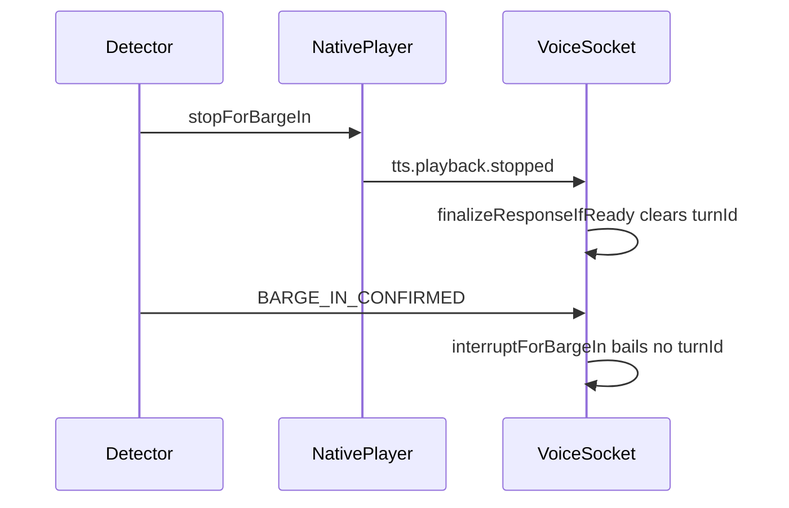

# Fix barge-in: stop old TTS and answer the latest query

## What “not working” is

You reported both:

- TTS **keeps talking**; the new question is ignored until it finishes.
- Sometimes TTS **stops**, but it **does not answer** the new question.

Today’s backend logs match that: after the 10:01 IST+5:30 relaunch there were **zero** `client.response.cancel` with `reason=barge_in`. The only cancel was `dispose` (app teardown). Native `BARGE_IN_CONFIRMED` / `echo_rejected` never appeared in Metro, latency JSONL, or backend. Acoustic barge-in is not completing the replacement-turn path on device.

The existing [AEC_BARGE_IN_END_TO_END_IMPLEMENTATION_PLAN.md](AEC_BARGE_IN_END_TO_END_IMPLEMENTATION_PLAN.md) is **partly stale** (it still describes `MIC` / `USAGE_MEDIA`). Current defaults are already `VOICE_COMMUNICATION` + SPEAKER + native detector. Do **not** re-implement Phases 1–5. Do **not** start with threshold tweaks or software AEC3.

Investigated with [why barge-in fails](f6b4ff40-fef3-4c93-8c08-f8c71d5046f6), [live logs](91fe5379-067c-4e51-ab4e-414eaada46e1), [detector gates](96273e13-2ee1-489c-95fd-6433689f16f9).

## Root causes (ranked)

### 1. Native stop races JS finalize (explains “stops, no new answer”)

Confirmed native path:

1. Detector confirms → `VoiceModule` calls `stopTtsPlaybackForBargeIn` **before** emitting `BARGE_IN_CONFIRMED` ([VoiceModule.kt](frontend/android/app/src/main/java/com/voiceaipoc/rn/VoiceModule.kt) ~1023–1039).
2. `TtsAudioPlayer.stopForBargeIn` fires `onPlaybackStopped` **before** returning ([TtsAudioPlayer.kt](frontend/android/app/src/main/java/com/voiceaipoc/voice/TtsAudioPlayer.kt) ~422–423).
3. JS handles `tts.playback.stopped` immediately: sets `ttsPlaybackTerminal`, then `finalizeResponseIfReady()` ([VoiceSocket.ts](frontend/src/voice/VoiceSocket.ts) ~1832–1843).
4. If the server already finished the LLM (`responseServerCompleted`, typical once TTS is still playing a long answer), finalize **clears `turnId` / `responseId`** and may start continuous-listen ([VoiceSocket.ts](frontend/src/voice/VoiceSocket.ts) ~2110–2138). `bargeInInFlight` is still false, so finalize is not blocked.
5. Later `BARGE_IN_CONFIRMED` hits `interruptForBargeIn`, which **returns immediately** if `!turnId` (~2332–2336). No `cancelResponse('barge_in')`, no preroll replacement turn.

Existing tests never simulate `tts.playback.stopped` **before** `BARGE_IN_CONFIRMED` ([phase9-barge-in.test.ts](frontend/__tests__/phase9-barge-in.test.ts)).

### 2. JS treats `localStopRequested === true` as mandatory (can ignore a real confirm)

[VoiceSocket.ts](frontend/src/voice/VoiceSocket.ts) ~2304–2309 drops any confirm unless `localStopRequested === true`. Native sets that from `wasActive` ([VoiceWebSocketTransport.kt](frontend/android/app/src/main/java/com/voiceaipoc/voice/VoiceWebSocketTransport.kt) ~900). If the player already stopped / response id mismatch, confirm is ignored even though the user spoke.

### 3. Loudspeaker hard-block `no_safe_acoustic_path` (explains “TTS never stops”)

On SPEAKER, confirm is **impossible** unless `MODE_IN_COMMUNICATION` is held **and** platform AEC reports available+enabled ([VoiceModule.kt](frontend/android/app/src/main/java/com/voiceaipoc/rn/VoiceModule.kt) ~1146–1159, [PlaybackAwareBargeInDetector.kt](frontend/android/app/src/main/java/com/voiceaipoc/vad/PlaybackAwareBargeInDetector.kt) ~191–200). ColorOS already needed a speakerphone force; if `actualMode` flaps to 0, every interrupt is degraded forever. This is the top acoustic suspect for symptom A, but **today’s logs do not contain `BARGE_IN_DECISION`**, so it is not proven until we emit those events.

Echo-reject (similarity ≥ 0.58) and the **1200 ms** playback guard can also swallow a real interrupt; treat those as follow-ups after telemetry exists. Do not lower thresholds first.

### What is already correct (leave it)

- Duplex `VOICE_COMMUNICATION` capture + TTS usage + SPEAKER route.
- Native detector as authoritative; local AudioTrack stop is response-scoped.
- Backend barge-in cancel + pending replacement turn ([gateway.py](backend/app/websocket/gateway.py) `_handle_response_cancel`). No protocol redesign.
- Preroll + `startTurn({ preserveMicrophone, includePreRoll, autoCommitOnSpeechEnd })` once interrupt actually runs.

## Fix plan

### Step 1 — Make barge-in own the stop (lifecycle)

In [VoiceSocket.ts](frontend/src/voice/VoiceSocket.ts):

- On `BARGE_IN_CONFIRMED`, set a pending flag **before** any playback-stopped finalize can run (or ignore `tts.playback.stopped` for that `responseId` when the stop was native barge-in).
- Do **not** call `finalizeResponseIfReady()` / `scheduleContinuousListen` for a barge-in stop. Interrupt must own teardown.
- In `interruptForBargeIn`, if a native confirm is present, **do not require** `snapshot.turnId`. Keep `responseId` from the event, still `cancelResponse('barge_in')`, then `startTurn` with preroll.
- Treat `localStopRequested` as telemetry: confirmed + matching `responseId` is enough to interrupt (still skip JS `stopPlayback` when native already stopped).

In native, prefer tagging playback-stopped as barge-in (reason on `notifyTtsPlayback`) so JS can distinguish user-stop vs barge-in vs natural stop. Keep `stopForBargeIn` itself — only fix ordering/ownership.

### Step 2 — Surface detector decisions (required to prove cause 3)

Native `BARGE_IN_*` decisions currently do not land in `logs/latency_trace.jsonl`. Forward `BARGE_IN_CONFIRMED` / `REJECTED_ECHO` / `DEGRADED` (including `no_safe_acoustic_path`) plus route health (`communicationModeActive`, `aecEnabled`, `automaticLoudspeakerBargeInAllowed`) through the existing latency-trace path so the next Oppo interrupt is diagnosable without a special logcat hunt.

### Step 3 — Oppo SPEAKER gate only if Step 2 shows `no_safe_acoustic_path`

If live decisions show mode/AEC flaps while TTS is clearly on speaker:

- Allow loudspeaker barge-in when `modeAcquired` is true even if `actualMode` is briefly wrong, **or** confirm in a **degraded** path with the existing stricter 0.90 / 640 ms / echo-reject rules.
- Keep the hard block only when AEC is actually unavailable **and** echo correlation is high.
- Do **not** enable software AEC3 in this pass.

If logs instead show `REJECTED_ECHO` on real speech, then tune residual/similarity with captured Oppo metadata — still not a rewrite.

### Step 4 — Tests (no full app rebuild unless native Kotlin changed)

Add JS coverage in [phase9-barge-in.test.ts](frontend/__tests__/phase9-barge-in.test.ts):

- `tts.playback.stopped` then `BARGE_IN_CONFIRMED` still sends `cancelResponse('barge_in')` and `startTurn({ includePreRoll: true })`.
- Confirm with `localStopRequested: false` still interrupts.
- Confirm after `turnId` cleared still interrupts.
- Natural `tts.playback.completed` still finalizes / continuous-listens (no regression).

If native stop tagging changes, add a focused Kotlin unit test around `stopForBargeIn` + listener order. Run existing `backend/tests/test_voice_barge_in_lifecycle.py` only if cancel payload changes (it should not).

### Step 5 — Verify on the connected Oppo (after you approve implementation)

During a **long spoken answer** (after wait phrase), interrupt with a new question:

- TTS must cut.
- Backend must log `reason=barge_in` (not `dispose` / `user_stopped`).
- Next assistant audio must answer the **new** query.
- Sitting silent during TTS must **not** cancel.

Then write `docs/<datetime>_barge_in_lifecycle_fix.md` per AGENTS.md.

## Out of scope

- Re-doing duplex AEC / `FarEndReferenceBuffer` / detector rewrite from the 2026-09-17 plan.
- Enabling `WEBRTC_AEC3` or `earlyBargeInEnabled` as the first fix.
- Backend protocol or LLM 400 (`llm_invalid_request` on shopping questions) — separate issue; barge-in still must cancel that turn.
