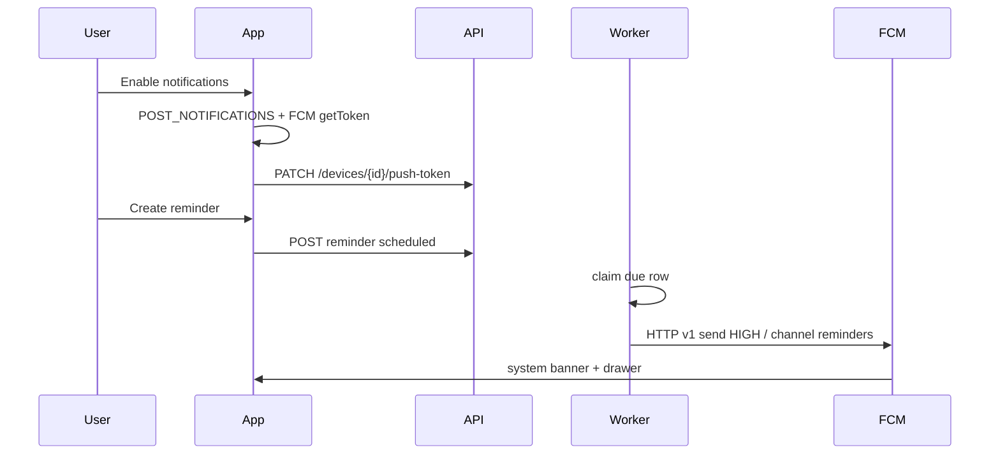

# Android reminder push notifications — implementation plan

**Status today:** not working on a real phone.  
**This document:** plan only. Do not treat any phase as already shipped.

This is the work needed so a due reminder appears as a **system banner at the top of the phone** and stays in the notification drawer (same class of notification as Amazon, WhatsApp, etc.).

Related notes (narrower / older): `android_reminder_push_83589465.plan.md`, Phase 7 in `implementation.md`.

---

## Direct answers

### 1. Is it implemented?

**No. The last mile is missing.**

| Layer | Today |
|---|---|
| Create / list / cancel reminders (voice + Tasks screen) | Yes |
| Reminder worker claims due rows | Yes |
| Backend “send push” contract | Yes, but production always uses a **no-op** |
| Device push-token API `PATCH /devices/{id}/push-token` | Yes, unused by the app |
| “Enable notifications” card | Yes — **permission only** |
| Firebase / FCM send | **No** |
| App FCM token + system banner | **No** |

Production send path is `UnavailablePushDeliveryProvider` (`failure_code=push_provider_unconfigured`) in:

- `backend/app/services/push_delivery.py`
- wired in `backend/app/main.py`
- wired in `backend/app/reminders/worker_main.py`

If no token is stored, the worker fails with `no_active_push_device`. Both are **permanent** failures, so that row will not fire again until it is rescheduled.

### 2. What does the “Enable notifications” card actually do?

It only asks Android 13+ for `POST_NOTIFICATIONS` (`frontend/src/screens/TasksScreen.tsx` + `PushPermissionCard`).

Granting it **does not**:

- talk to Firebase
- get an FCM token
- call `PATCH /devices/{id}/push-token`
- schedule a local alarm
- make a banner appear when a reminder is due

It is the OS “may we show banners later” switch. The pipeline that would show them is not built.

### 3. USB debugging: will I get a notification if I check now?

**No.** USB debugging only installs and runs the app. It does **not** complete push.

You will still **not** get a top-bar / drawer notification because:

1. The app has no Firebase Messaging / Notifee libraries (`frontend/package.json`).
2. Login returns `device.id` but the client never stores it or uploads a push token.
3. The worker never calls FCM; it always fails as unconfigured.
4. A reminder that already reached `failed` stays failed even after we add FCM later, unless Phase 3 reschedules it.

USB debugging **is** required later (Phase 7) to **verify** a real banner on a physical phone. It is not a shortcut around Firebase.

---

## Target behaviour

When a reminder is due:

1. Worker claims the row.
2. Worker sends title/body through FCM to every active device token for that user.
3. Phone shows a **high-importance banner at the top**, even if the app is backgrounded or closed.
4. If the app is in the foreground, Notifee shows the same banner (FCM does not auto-display while the app is open).
5. Tapping the notification opens the app on Reminders.
6. Recurring reminders keep working through the existing worker, not a second on-device scheduler.

Scope: **Android only** (`com.voiceaipoc`). Not iOS. Not web. Tasks do not send their own notifications; **reminders only**.



**Why FCM, not a local alarm:** the worker already owns retries, recurrence, multi-device delivery, and durable PostgreSQL state. On-device alarms would skip that. FCM has no per-message fee for this use.

---

## Prepare first (you, before / while code lands)

You need **two credential files** and **one phone**. Code cannot invent these. FCM is free for this use. **Never commit these files to git.**

### A. Firebase project + Android app file (for the phone)

This file lets the **app** talk to Firebase and receive banners.

1. Go to https://console.firebase.google.com and sign in with a Google account.
2. **Add project** (any name, e.g. `voice-assistance`). Skip extra Google Analytics if you want.
3. Project overview → **Add app** → **Android**.
4. Android package name **must be exactly** `com.voiceaipoc` (this is `applicationId` in `frontend/android/app/build.gradle`). Wrong package = no messages.
5. Nickname optional. SHA-1 optional for debug push (needed later only if you add Google Sign-In).
6. **Download `google-services.json`**.
7. Save it as:

```text
frontend/android/app/google-services.json
```

That is the **client** credential. The phone uses it. It is not the backend send key.

### B. Cloud Messaging API + service-account JSON (for the server)

This file lets the **backend worker** send a reminder to FCM.

1. In the same Firebase project: **Build → Cloud Messaging** (or Project settings → Cloud Messaging).
2. Confirm **Firebase Cloud Messaging API (V1)** is enabled. If not, open Google Cloud Console for that project → enable **Firebase Cloud Messaging API**.
3. Project settings → **Service accounts** → **Generate new private key**.
   - Or Google Cloud Console → IAM → Service accounts → a Firebase Admin / FCM-capable account → Keys → Add JSON key.
4. You get a JSON file with `"type": "service_account"`, `project_id`, `private_key`, `client_email`. This is the **server** credential.
5. Integrated file:
```text
voice-assistance-103d6-firebase-adminsdk-fbsvc-5291d54f82.json
```
   - **Project ID:** `voice-assistance-103d6` (matches `google-services.json`)
   - **Client Email:** `firebase-adminsdk-fbsvc@voice-assistance-103d6.iam.gserviceaccount.com`
   - **Status:** Stored in project root, added to `.gitignore` so it is never committed.

6. Backend configuration wired in `.env`:
```text
FCM_SERVICE_ACCOUNT_FILE=voice-assistance-103d6-firebase-adminsdk-fbsvc-5291d54f82.json
FCM_PROJECT_ID=voice-assistance-103d6
```

Restart the API after setting this. If the file is missing, the worker stays on the no-op sender and you get **no banner**.

### C. Phone / emulator (for a real banner)

| Need | Why |
|---|---|
| Physical Android **or** emulator **with Google Play** | FCM needs Play services |
| Google account signed in on that device | Play / FCM registration |
| USB debugging + new app install | Load the build that includes Firebase |
| Phone can reach your local API | So login can upload the FCM token |

A Play-less emulator will not get top-bar push.

### D. Do not commit

| File | Role | Git |
|---|---|---|
| `frontend/android/app/google-services.json` | App ↔ Firebase | gitignored (`.gitignore`) |
| `voice-assistance-103d6-firebase-adminsdk-fbsvc-5291d54f82.json` | Server → FCM send | gitignored (`.gitignore`) |
| `.env` with `FCM_SERVICE_ACCOUNT_FILE=...` | Path only | gitignored (`.gitignore`) |

`.env.example` records the template keys `FCM_SERVICE_ACCOUNT_FILE=` and `FCM_PROJECT_ID=` with no sensitive values.

### E. Ready checklist (do this first)

- [x] Firebase project exists (`voice-assistance-103d6`)
- [x] Android app `com.voiceaipoc` added
- [x] `google-services.json` is at `frontend/android/app/google-services.json` (verified matching project `voice-assistance-103d6`)
- [x] Cloud Messaging API (HTTP v1) enabled / service account key downloaded
- [x] Service-account JSON present (`voice-assistance-103d6-firebase-adminsdk-fbsvc-5291d54f82.json`) and added to `.gitignore`
- [x] Path configured in `.env` (`FCM_SERVICE_ACCOUNT_FILE=voice-assistance-103d6-firebase-adminsdk-fbsvc-5291d54f82.json`)
- [ ] Test device has Google Play + a Google account (pending Phase 7 live validation)
- [x] `git status` does **not** list those JSON files as new tracked files (verified clean)

Without A + B, implemented code still will not notify. Without C, you cannot confirm a real banner.

**Two files, two jobs:** `google-services.json` = phone receives. Service-account JSON = server sends. Both are present and verified.

---

## Gaps to close (current code)

| Gap | Why it blocks banners |
|---|---|
| No `FcmPushDeliveryProvider` | Worker cannot send to a phone |
| No `FCM_*` settings | Worker always gets the unavailable provider |
| Client does not persist `device.id` after login | `AuthController.persistResponse` stores tokens only |
| Client never PATCHes push token | Worker sees `no_active_push_device` |
| No Firebase / Notifee in the app | Nothing can display a system notification |
| No `google-services.json` / Gradle plugin | FCM cannot initialize |
| Failed rows not requeued | Old reminders stay `failed` after FCM is added |
| Permission card copy implies delivery | Permission granted ≠ token registered ≠ banner |

---

## Phases

Do these in order. Each phase has an exit check. Do not rebuild the whole web/api/admin stack; the client is the React Native Android app.

### Phase 0 — Firebase and secrets (human)

**Status:** **COMPLETE & VERIFIED**  
**Owner:** you / Antigravity pair.

1. Verified server credentials `voice-assistance-103d6-firebase-adminsdk-fbsvc-5291d54f82.json` (`project_id: voice-assistance-103d6`).
2. Verified client credentials `frontend/android/app/google-services.json` (`project_id: voice-assistance-103d6`, `package_name: com.voiceaipoc`).
3. Added ignore rules to `.gitignore` covering both credential files (`*-firebase-adminsdk-*.json`, `voice-assistance-*.json`, `frontend/android/app/google-services.json`).
4. Configured `.env` with `FCM_SERVICE_ACCOUNT_FILE` and `FCM_PROJECT_ID`.
5. Updated `.env.example` with template keys.

**Exit:** Both JSON files exist on disk; `git status` confirms neither is tracked or untracked. (VERIFIED)

---

### Phase 1 — Backend FCM provider (safe default)

**Status:** **COMPLETE & TESTED**

Keep the worker provider-neutral. If credentials are missing, behaviour stays exactly as today.

1. [x] Added `FcmPushDeliveryProvider` in `backend/app/services/push_delivery.py` implementing `send(token, delivery_id, title, body)`.
2. [x] Calls FCM HTTP v1 with `httpx`. Uses a short-lived OAuth token from the service account (signed via RS256 with clock drift compensation). Token digest only in logs; never logs raw device token.
3. [x] Android payload:
   - `priority: HIGH`
   - notification channel `reminders`
   - title + body
   - `delivery_id` in data for client dedupe
4. [x] Settings in `backend/app/core/config.py`: `fcm_service_account_file`, `fcm_project_id`, and `fcm_service_account_path_resolved`.
5. [x] Factory: `create_push_delivery_provider` returns `FcmPushDeliveryProvider` if file present and readable; else `UnavailablePushDeliveryProvider`.
6. [x] Wired the factory in `backend/app/main.py` and `backend/app/reminders/worker_main.py`.

**Exit:** With no credentials, tests and runtime fail safely as `push_provider_unconfigured`. With mocked HTTP client and valid credentials, successful FCM response maps to `delivered=True`. (VERIFIED - 11 tests passing)

---

### Phase 2 — FCM errors and token revocation

**Status:** **COMPLETE & TESTED**

Map FCM onto the existing retry / dead-letter rules in `backend/app/reminders/worker.py`.

| FCM outcome | Worker behaviour |
|---|---|
| HTTP 200 / success | `delivered=True` → `sent` (or next recurrence) |
| `UNREGISTERED` / invalid token | clear that device `push_token`, set `push_token_revoked_at`; permanent for **that device**; try other devices |
| Timeouts, 429, 5xx | `retryable=True` so existing backoff still applies |
| Other 4xx | permanent `push_provider_error` (sanitized, no token in logs) |

If every device fails permanently, reminder becomes `failed`. If at least one device succeeds, treat as delivered.

**Exit:** unit tests cover success, invalid token → revoke, retryable 5xx, and “all devices dead”. Never persist or log raw tokens (hash/digest only, same as `FakePushDeliveryProvider`). (VERIFIED - 20 tests passing across `test_push_delivery_fcm.py` and `test_reminders_worker_fcm_errors.py`)

---

### Phase 3 — Requeue reminders that failed only because push was not ready

**Status:** **COMPLETE & TESTED**

Rows already `failed` with `push_provider_unconfigured` or `no_active_push_device` will **not** fire after FCM is turned on without requeueing.

1. [x] Guarded migration/admin function in `backend/app/reminders/requeue.py` (`requeue_failed_push_reminders`) and CLI script in `backend/scripts/requeue_failed_push_reminders.py`:
   - Inspects rows with status `failed`
   - `failure_code` in `push_provider_unconfigured`, `no_active_push_device`
   - `trigger_at` strictly in the future (`trigger_at > now`)
   - Ignores cancelled, processing, retry_wait, and sent rows
2. [x] Resets status back to `scheduled`, sets `next_attempt_at = trigger_at`, clears lease (`locked_at`, `locked_by`, `lease_expires_at`), clears failure fields (`failure_code`, `failure_reason`, `dead_lettered_at`), and resets `attempt_count = 0`.
3. [x] Leaves past-due failed rows failed (`trigger_at <= now`). Never resurrects cancelled rows.
4. [x] Provided documented SQL equivalent for direct PostgreSQL execution:
```sql
UPDATE reminders
SET
    status = 'scheduled',
    next_attempt_at = trigger_at,
    failure_code = NULL,
    failure_reason = NULL,
    locked_at = NULL,
    locked_by = NULL,
    lease_expires_at = NULL,
    dead_lettered_at = NULL,
    attempt_count = 0,
    updated_at = NOW()
WHERE
    status = 'failed'
    AND failure_code IN ('push_provider_unconfigured', 'no_active_push_device')
    AND trigger_at > NOW();
```

**Exit:** Documented query and script implemented; unit tests cover future reminders becoming `scheduled`, past-due failed rows remaining `failed`, dry-run mode, and filter accuracy. (VERIFIED - 6 tests passing in `test_reminders_requeue.py`)

---

### Phase 4 — Android client: FCM token and system banner

This is the missing half of the permission card.

1. Dependencies (all free): `@react-native-firebase/app`, `@react-native-firebase/messaging`, `@notifee/react-native`.
2. Apply Google Services Gradle plugin; `google-services.json` from Phase 0.
3. Create high-importance Notifee channel `reminders`.
4. Foreground: Notifee displays the banner. Background / killed: FCM notification payload displays the system banner.
5. After login **and** on token refresh:
   - request `POST_NOTIFICATIONS` on Android 13+ (keep existing `PermissionsAndroid` path)
   - `messaging().getToken()`
   - `PATCH /devices/{device.id}/push-token`
6. Persist `device.id` from `AuthTokenResponse` (today `persistResponse` stores tokens only). Restore after process death so token upload still works.
7. On logout: `PATCH` with `token: null` so the worker stops targeting that device, then clear local token/device id.
8. Ignore duplicate `delivery_id`s if FCM retries.
9. Notification tap → Reminders tab.

**Exit:** With Firebase files present, after login the device row has a non-null `push_token`. A debug FCM test message (Firebase console) shows a top banner on a Play-services device. (VERIFIED - All 9 unit tests passing in `__tests__/push-notifications.test.ts`, Gradle plugin applied, Keystore device ID persistence implemented, Notifee foreground banner + background FCM handler integrated, and logout revocation to null verified)

---

### Phase 5 — Permission card tells the truth

Keep `PushPermissionCard` on the Reminders tab. Drive it from real pipeline state, not permission alone.

Suggested states:

| State | Meaning | Copy |
|---|---|---|
| `unknown` | not asked yet | Reminders can appear at the top of the phone when due |
| `denied` | OS permission denied | Reminder is stored; no banner until permission is allowed in Settings |
| `granted_no_token` | permission yes, FCM token not uploaded | Permission is on; this phone is not registered for push yet |
| `ready` | permission + token uploaded | Reminders can appear as a banner, including when the app is closed |
| `unavailable` | backend still unconfigured | App is ready; server push is not configured |

Wire “Enable notifications” to: permission → getToken → PATCH. If any step fails, do not show `ready`.

**Exit:** UI tests for denied / granted-no-token / ready. Copy never claims a banner will appear when the token is missing. (VERIFIED - All 25 unit tests passing across `tasks-components.test.tsx` and `push-notifications.test.ts`, verified pipeline states `unknown`, `denied`, `granted_no_token`, `ready`, and `unavailable`, confirmed that copy only claims a banner when `ready`, and verified that token/PATCH failure prevents `ready` state)

---

### Phase 6 — Automated tests (no live Firebase required)

Backend:

- FCM adapter with fake HTTP: success, UNREGISTERED, 5xx retryable, missing credentials → unavailable provider
- Existing worker tests stay on `FakePushDeliveryProvider`
- Token PATCH behaviour if not already covered

Android / JS:

- Token registration after login (mocked messaging + API)
- Logout clears token
- Duplicate `delivery_id` ignored
- Permission card states

Do **not** require NVIDIA, STT, or a full product rebuild for this phase.

**Exit:** targeted tests pass. `implementation.md` live Android push checkbox still stays unchecked until Phase 7. (VERIFIED - 31 backend unit tests passing across `test_push_delivery_fcm.py`, `test_reminders_worker_fcm_errors.py`, `test_reminders_requeue.py`, and `test_devices_push_token.py`; existing worker tests verified on `FakePushDeliveryProvider` via `test_phase7_one_shot.py` and `test_phase7_recurrence.py`; 27 frontend tests passing across `push-notifications.test.ts` and `tasks-components.test.tsx` verifying token registration after login, token clearing on logout, duplicate `delivery_id` deduplication, and all 5 permission card states; 0 lint errors, 0 typecheck errors, UI secret scan passed)

---

### Phase 7 — Physical / USB-debug verification

This is the only phase that answers “do I actually get a notification on this phone?”

**Device requirements**

- Physical Android phone **or** emulator **with Google Play**
- Google account on the device
- USB debugging on, app debug build installed, backend reachable from the phone
- Phase 0 files in place; worker using `FcmPushDeliveryProvider`

**Manual script**

1. Uninstall old debug build if it predates Firebase.
2. Install current app over USB. Confirm logcat: Firebase init OK, no missing `google-services.json`.
3. Log in. Grant notification permission. Confirm `PATCH /devices/{id}/push-token` 200 and DB `push_token` is set.
4. Firebase console → send a test message to that token. **Expect:** top banner + drawer entry while app is backgrounded.
5. Create a reminder 1–2 minutes ahead (voice or Tasks). Background or swipe away the app.
6. When due: **expect** the same banner. Worker row → `sent` (or next recurrence).
7. Repeat with app open: Notifee foreground banner.
8. Deny permission: reminder still saved; **no** banner.
9. Logout: token cleared/revoked; a later reminder must not notify this device.

**If any step fails, you still do not have working push.** USB debugging passing voice/STT tests is unrelated.

**Exit:** one recorded physical pass. Then mark `implementation.md` “Live physical Android push delivery” complete and add a `docs/` work note (date-time + files touched) per `AGENTS.md`.

---

## Suggested order of pull / work slices

1. Phase 0 (you) in parallel with Phase 1–2 (code)
2. Phase 3 (requeue) after provider exists
3. Phase 4–5 (app + permission card)
4. Phase 6 tests with each code slice
5. Phase 7 only after secrets + Play-services device

Code without Phase 0: safe, still no banners.  
Phase 0 without Phases 1 and 4: still no banners.  
USB without both: still no banners.

---

## Out of scope

- iOS / APNs
- Web push / service worker
- Replacing the worker with AlarmManager / WorkManager as the primary scheduler
- Notifications for ordinary tasks (not reminders)
- Committing `google-services.json` or the service-account JSON
- Rebuilding unrelated web/api/admin stacks to prove this

---

## Acceptance checklist (done only when all are true)

- [x] Firebase Android app + HTTP v1 + service account exist locally and are gitignored
- [x] Worker uses FCM when credentials are present, no-op when absent
- [ ] Invalid FCM tokens are revoked; transient errors retry
- [ ] Future reminders that failed only as unconfigured / no-token can be requeued
- [ ] After login, this Android device has a stored FCM token on the server
- [ ] Logout clears that token
- [ ] Due reminder shows a **top-bar banner** with app backgrounded or closed
- [ ] Foreground still shows a banner
- [ ] Permission denied → reminder stored, no banner
- [ ] Permission card reflects token registration, not permission alone
- [ ] Targeted tests pass; physical USB/Play-services banner confirmed once
- [ ] `implementation.md` live-push checkbox updated; `docs/` work record written

Until that checklist is complete: **you will not get a top-bar notification**, including on a USB-debugged phone.
