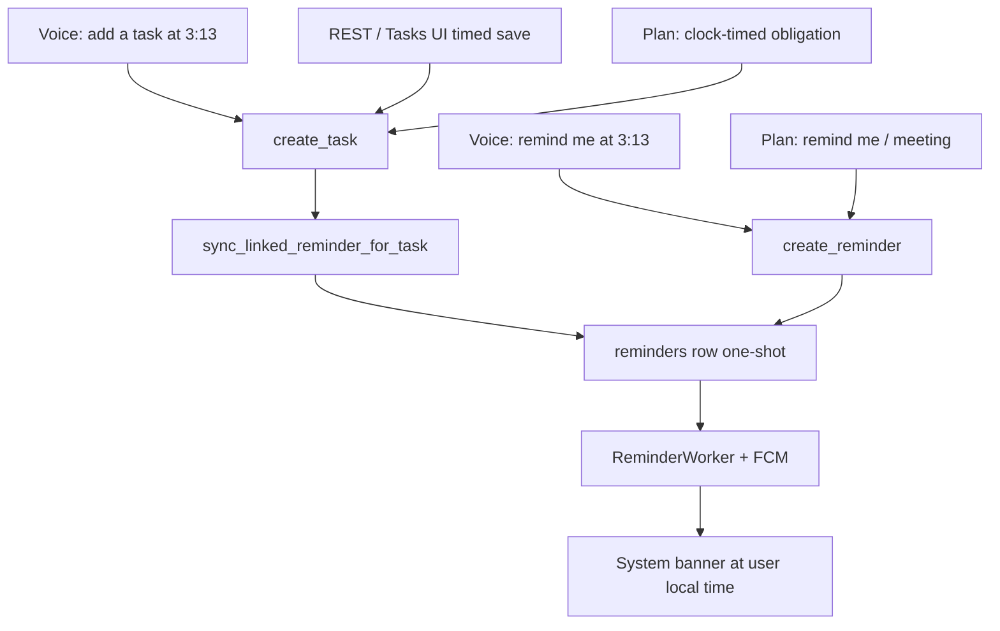

# Reminders and timed-task notifications

Product lock from you: spoken **“remind me …” creates a reminder only** (Reminders tab + banner at that time). Timed **tasks** still get a **linked one-shot reminder** so a due clock fires a banner. Date-only tasks (no clock / EOD 23:59) do **not** notify.

Timezone rule for every slice: interpret wall time in the **device IANA zone**, store **UTC** `trigger_at`/`due_at`, fire on UTC. Do not parse 3:13 using Windows/IST. Clock-skew hardening of REST `SystemClock` is **out of this plan** unless a slice cannot ship without it.

---

## Slice 1 — Voice “remind me” → `create_reminder`

**Today:** [backend/app/llm/context.py](backend/app/llm/context.py) `classify_voice_tool_choice` (lines 140–143) and `VOICE_TOOL_ROUTING_INSTRUCTIONS` (lines 41–44) force **every** remind/set-reminder phrase onto `create_task`. `_TASK_ACTION` also matches “set/create a reminder”. `create_reminder` is already in the normal-mode registry with `reminders:write` and confirmation.

**Change:**
- Split routing: `_REMINDER_ACTION` / “set|create|schedule a reminder” → `create_reminder` if that tool is registered.
- Keep “add/create a task” and scheduled meeting/call (`_SCHEDULED_ITEM` + temporal) on `create_task`.
- Remove `reminder` from `_TASK_ACTION` (or check reminder patterns **first**).
- Update prompt so reminder requests must call `create_reminder`, not `create_task`.
- [backend/app/routing/rules.py](backend/app/routing/rules.py): `_REMINDER_TASK_CREATION` → `ActionDomain.REMINDER` (comment at 300–303 is now wrong).
- [backend/app/websocket/gateway.py](backend/app/websocket/gateway.py): temporal clarification for `create_reminder` (today only `create_task` at ~2357–2473); dedicated success/fail/reject copy (“I created the reminder …”) instead of “Done. I completed create reminder.”
- Timeless “remind me to call Harsh” (no clock) → spoken clarification, not a task with null due.

**Tests that currently lock the old semantics** (must flip):
- [backend/tests/test_llm_context.py](backend/tests/test_llm_context.py)
- [backend/tests/fixtures/phase7_action_acceptance_v1.json](backend/tests/fixtures/phase7_action_acceptance_v1.json) + [backend/tests/test_phase7_action_acceptance.py](backend/tests/test_phase7_action_acceptance.py)
- [backend/tests/test_router_rules.py](backend/tests/test_router_rules.py)
- Align remaining corpora: phase0 router corpus, phase5 eval/live scripts, [backend/tests/test_device_aware_time.py](backend/tests/test_device_aware_time.py)

Frontend confirmation already supports `create_reminder` ([frontend/src/voice/conversation.ts](frontend/src/voice/conversation.ts)). No UI card change.

---

## Slice 2 — Shared helper: timed task → linked reminder

**Today:** REST/UI/`create_task` write `Task` only. Worker never reads `tasks`. `task_id` FK is `ON DELETE SET NULL`, so deleting a task **leaves a live reminder** unless we cancel it. Plan mode only links if the extractor already emitted both ops with the same title.

**Add** [backend/app/services/task_linked_reminders.py](backend/app/services/task_linked_reminders.py):

`sync_linked_reminder_for_task(session, task, reason=due_set|due_changed|due_cleared|completed|cancelled|deleted)`

- At most **one** active one-shot reminder per task (`recurrence_rule=None`, `delivery_channel=push`, `trigger_at = due_at`, same timezone).
- `due_set` / `due_changed` with a **real clock** → create or reschedule.
- Skip date-only / local 23:59 EOD (matches plan `missing_time` for reminders and Tasks UI requiring both date and time).
- `due_cleared` / complete / cancel / delete → **cancel** linked scheduled reminder **before** delete (do not rely on FK).
- Internal side-effect of task mutation: do **not** call the `create_reminder` tool (avoids a second confirmation). Voice already has `reminders:write`; REST uses the same DB session.

**Call sites:**
- [backend/app/api/tasks.py](backend/app/api/tasks.py) create (~78), update (~173), complete (~203), delete (~226)
- [backend/app/llm/task_tools.py](backend/app/llm/task_tools.py) create/update/complete/delete handlers after flush
- Plan path: helper runs inside `create_task`; **do not** also synthesize a second reminder (see slice 4)

Frontend Tasks UI needs **no** extra POST if REST is wired. Linked rows **will** appear on the Reminders tab (that is how the worker fires). Title can stay the task title.

**Tests:** helper unit tests (idempotent upsert, reschedule, cancel on complete/delete, no EOD notify, no duplicate). REST + voice tool tests asserting one linked row.

---

## Slice 3 — Plan clock-timed obligations notify

**Today:** extractor prompt in [backend/app/planning/extraction.py](backend/app/planning/extraction.py) line 103: “obligations use task.” Clock-timed “call Harsh at 3:13pm” → `CREATE_TASK` only → no banner. Meetings already → `CREATE_REMINDER`.

**Approach (executor + helper, not reminder-only obligations):**
- Keep obligations as **tasks** so they stay on the Tasks list.
- Clock-timed AUTO `CREATE_TASK` → helper from slice 2 creates the linked reminder (same `due_at` instant, `task_id` set).
- Soften extractor prompt (A-lite): clock-timed obligations may be a task (notify via link); reminder language / stated meetings stay `reminder`; **do not emit two reminders for one item**; date-only stays task with no notify.
- [backend/app/planning/resolution.py](backend/app/planning/resolution.py): attach explicit `has_clock` (do **not** treat 23:59 as a clock).
- [backend/app/planning/executor.py](backend/app/planning/executor.py): if extractor already emits matching `CREATE_TASK` then `CREATE_REMINDER`, skip a second helper create (upsert / “already coupled” guard). Existing title-coupling at ~614–629 stays for meetings that also have a task.

**Tests:** “I need to call Harsh at 3:13 PM” → task + one reminder; date-only Friday → task only; existing meeting-Friday-4pm golden stays reminder; `test_replay_after_midnight_preserves_scheduled_time` may expect two saved actions if a clock task now links a reminder.

Plan flags/allowlist stay as they are; this only changes what gets written when plan auto-actions already run.

---

## Slice 4 — Local “task created” ack (after 1–3)

Client-only Notifee. **Not FCM.** Do not run this until routing + helper exist so “remind me” is not mislabeled as a task.

- [frontend/src/notifications/PushNotificationService.ts](frontend/src/notifications/PushNotificationService.ts): channel `tasks`, `displayLocalTaskCreatedNotification`, tap `data.kind=task_created` → Tasks tab (not Reminders).
- [frontend/src/screens/TasksScreen.tsx](frontend/src/screens/TasksScreen.tsx): after **create** only (~308–320), fire-and-forget; keep StatusBanner; skip updates.
- Voice: on `tool.status` `create_task` + `success`, once per `toolCallId` in [frontend/src/voice/VoiceSocket.ts](frontend/src/voice/VoiceSocket.ts). Static title “Task created” (`result` is null on the client). Do **not** fire on `create_reminder`.
- Permission denied → silent; local ack does not need FCM token.
- Tests in [frontend/__tests__/push-notifications.test.ts](frontend/__tests__/push-notifications.test.ts).

---

## Slice 5 — Live phone check + requeue (human + ops)

Code for requeue already exists: [backend/app/reminders/requeue.py](backend/app/reminders/requeue.py), CLI [backend/scripts/requeue_failed_push_reminders.py](backend/scripts/requeue_failed_push_reminders.py). Only **future** `trigger_at` rows with `push_provider_unconfigured` / `no_active_push_device` are reset. Past-due failed rows stay failed — create a new 1–2 minute reminder instead.

**Small code fix worth doing here:** AndroidManifest default FCM channel → `reminders` so Firebase Console tests stop landing on the blank fallback channel ([implementation.md](implementation.md) Phase 7 note). Worker payload already sets `channel_id: reminders`.

**Ops / human (agent cannot finish USB verification):**
1. API + worker with `FCM_SERVICE_ACCOUNT_FILE` readable; `REMINDER_WORKER_ENABLED=true`.
2. Dry-run then requeue: `python scripts/requeue_failed_push_reminders.py --dry-run` then without `--dry-run`.
3. USB script: login, grant permission, token PATCH, reminder 1–2 min ahead (voice **and** Tasks), FG Notifee + BG banner, deny permission, logout token clear.
4. Mark Phase 7 in [implementation.md](implementation.md) only after a real top-bar pass; write the AGENTS.md docs note.

Do **not** rebuild web/api/admin/mobile stacks to prove this; targeted pytest + frontend unit tests, then one phone pass.

---

## Order and docs

1. Slice 1 (voice routing) — [COMPLETED]
2. Slice 2 (helper + REST + `create_task`) — [COMPLETED]
3. Slice 3 (plan `has_clock` + duplicate guard) — [COMPLETED]
4. Slice 4 (local ack) — [COMPLETED]
5. Slice 5 (channel meta, requeue ops, USB) — [COMPLETED] (code fix + requeue done; live USB steps documented)

Implementation documentation: [docs/20261007_173700_reminders_timed_notify_.md](docs/20261007_173700_reminders_timed_notify_.md).
